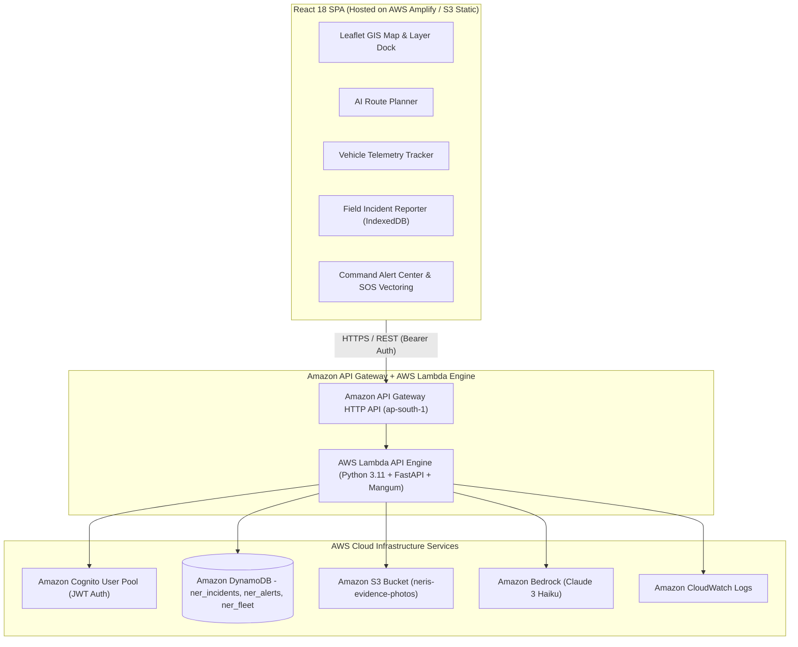
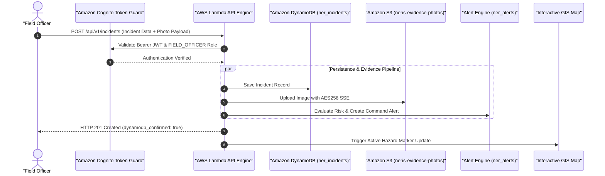
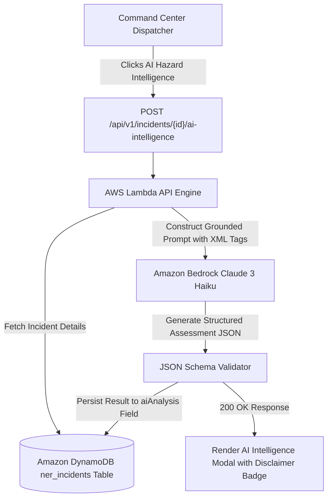
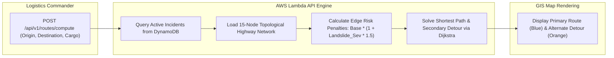
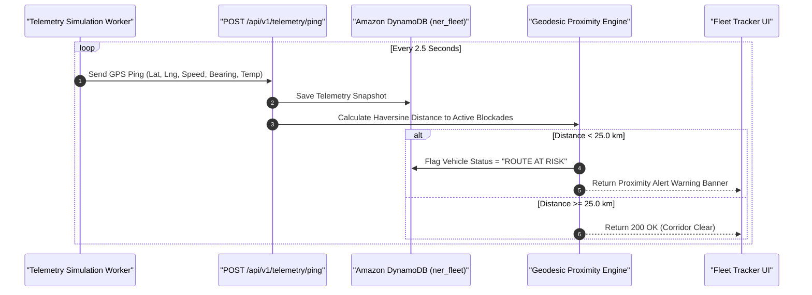
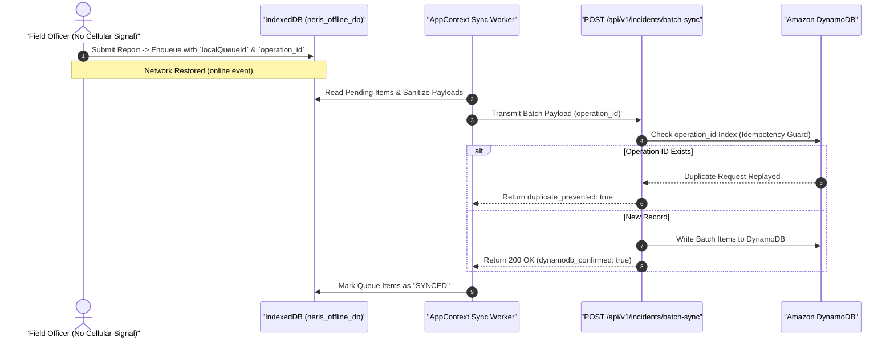
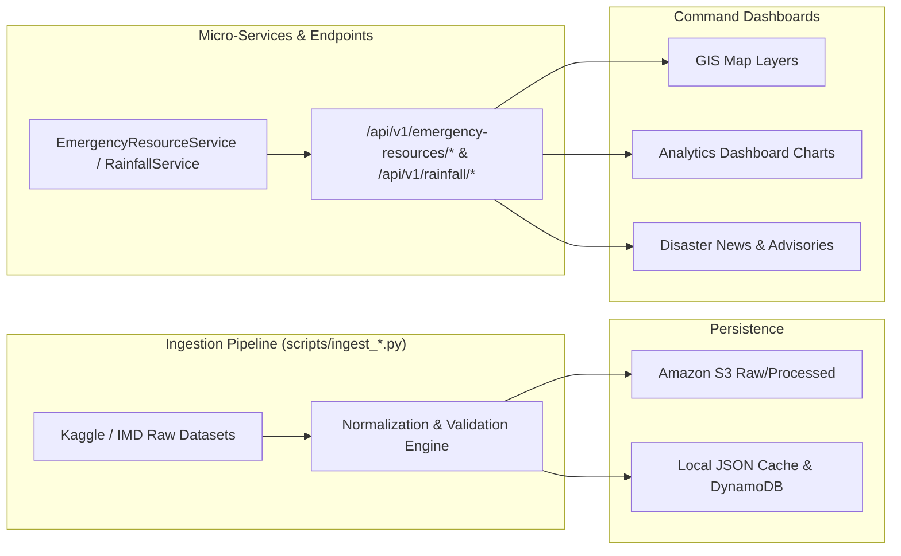

# 🏗️ System Architecture — NERIS — North-East Regional Emergency Transit System

> **Project**: NERIS — North-East Regional Emergency Transit System  
> **Target Region**: `ap-south-1` (Asia Pacific - Mumbai)  
> **AWS First Commit Track**: Ship It Track  
> **Disclaimer**: NERIS is an independent student project and is not affiliated with the U.S. NERIS framework.

---

## 1. High-Level System Architecture

NERIS is designed as an event-driven, serverless logistics and emergency transit platform. The system decouples client rendering, API execution, data persistence, object storage, identity management, and artificial intelligence into dedicated cloud components.

---

## 2. Core Subsystem Workflows

### 2.1 Field Incident Reporting & Media Storage Workflow

---

### 2.2 Amazon Bedrock AI Incident Intelligence Workflow

---

### 2.3 Terrain-Aware Corridor Risk Routing Workflow

---

### 2.4 Convoy Telemetry & Proximity Alerting Workflow

---

### 2.5 Offline-First Incident Queue & Idempotent Sync Workflow

---

### 2.6 Historical Emergency Resource Allocation Intelligence Subsystem

---

## 3. Technology Stack Summary

* **Frontend**: React 18, Vite, Vanilla CSS Design System, Leaflet GIS, Recharts, IndexedDB.
* **API & Compute**: AWS Lambda (Python 3.11), Amazon API Gateway, Mangum ASGI, FastAPI.
* **Persistence & Storage**: Amazon DynamoDB, Amazon S3 (`PublicAccessBlockConfiguration` + `AES256`).
* **Authentication**: Amazon Cognito User Pools (`NerisCommandUserPool`), JWT RSA-256 validation.
* **Artificial Intelligence**: Amazon Bedrock (`anthropic.claude-3-haiku-20240307-v1:0`).
* **Observability & Scheduled Events**: Amazon CloudWatch Logs, Amazon EventBridge.
