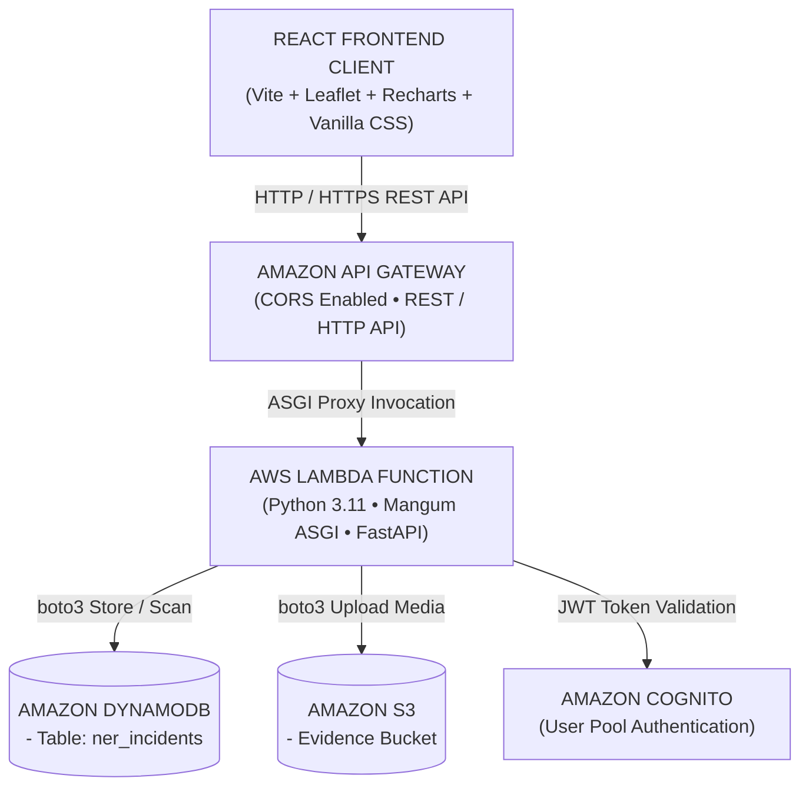

# AWS Serverless Architecture & Infrastructure Specification

**Project:** NERIS — North-East Regional Emergency Transit System  
**Hackathon Phase:** AWS / WeMakeDevs First Commit — First Implementation Phase  
**Architecture:** Managed AWS Serverless Cloud Native Stack  
*Disclaimer: NERIS is an independent student project and is not affiliated with the U.S. NERIS framework.*


---

## 1. System Architecture

The application connects the existing React 18 client to a cloud-native AWS Serverless infrastructure:



### Component Breakdown
1. **React Frontend**: Client web application running on Vite. Interacts with Amazon API Gateway endpoints for health checks, live incident retrieval, report submission, and evidence upload.
2. **Amazon API Gateway (`NerisApi`)**: Managed HTTP API Gateway handling routing, CORS preflight policies, rate-limiting, and proxying requests to AWS Lambda.
3. **AWS Lambda (`NerisApiFunction`)**: Serverless Python 3.11 function running the Mangum ASGI handler for FastAPI. Executes business logic, risk calculations, and database operations.
4. **Amazon DynamoDB (`NerisIncidentsTable`)**: Managed NoSQL table storing field incident reports with pay-per-request pricing (`PAY_PER_REQUEST`). Primary key: `id` (String).
5. **Amazon S3 (`NerisEvidenceBucket`)**: Managed Object Storage bucket (`neris-evidence-photos-ap-south-1`) storing uploaded field incident evidence media.
6. **Amazon Cognito (`NerisUserPool`)**: User Directory providing authentication, token verification, and role-based access control for Commanders and Officers.

---

## 2. Infrastructure-as-Code (AWS SAM `template.yaml`)

The entire serverless stack is defined declaratively in [`template.yaml`](file:///c:/Users/Lenovo/OneDrive/Desktop/New%20folder/template.yaml):

- **`AWS::DynamoDB::Table`**: `ner_incidents`
- **`AWS::S3::Bucket`**: `neris-evidence-photos-ap-south-1`
- **`AWS::Cognito::UserPool`**: `NerisCommandUserPool`
- **`AWS::Serverless::Api`**: `NerisApi` (CORS enabled)
- **`AWS::Serverless::Function`**: `NerisApiFunction` (FastAPI handler wrapper with DynamoDB & S3 CRUD policies)

---

## 3. Environment Variables

Configure backend and client environment variables in `.env`:

```env
# AWS Region & Environment
AWS_REGION=ap-south-1
ENVIRONMENT=production
APP_NAME="NERIS: AWS Logistics Engine"

# DynamoDB Table Name
DYNAMODB_INCIDENTS_TABLE=ner_incidents

# Amazon S3 Evidence Bucket Name
S3_BUCKET_EVIDENCE=neris-evidence-photos-ap-south-1

# Amazon Cognito User Pool Credentials
COGNITO_USER_POOL_ID=ap-south-1_NerisUserPool
COGNITO_CLIENT_ID=neriswebclientid
```

---

## 4. Deployment Steps (AWS SAM CLI)

### Prerequisites
- AWS CLI configured (`aws configure` with access keys)
- AWS SAM CLI installed (`sam --version`)
- Python 3.11 runtime

### Step 1: Validate Infrastructure Template
```bash
sam validate -t template.yaml
```

### Step 2: Build Serverless Artifacts
```bash
sam build -t template.yaml
```

### Step 3: Deploy to AWS Cloud
```bash
sam deploy --guided \
  --stack-name neris-disaster-logistics-stack \
  --region ap-south-1 \
  --capabilities CAPABILITY_IAM CAPABILITY_AUTO_EXPAND
```

After deployment completes, SAM outputs the live API Gateway endpoint URL:
`https://<api-id>.execute-api.ap-south-1.amazonaws.com/Prod/`

---

## 5. Local Development & Verification

### Step 1: Run Backend FastAPI Server locally
```bash
cd backend
python -m uvicorn app.main:app --host 0.0.0.0 --port 8000
```

### Step 2: Verify Health Endpoint
```bash
curl http://localhost:8000/health
```
**Expected Output:**
```json
{
  "status": "HEALTHY",
  "aws_architecture": "React Frontend -> Amazon API Gateway -> AWS Lambda -> Amazon DynamoDB",
  "aws_region": "ap-south-1",
  "dynamodb_table": "ner_incidents",
  "s3_bucket": "neris-evidence-photos-ap-south-1",
  "cognito_user_pool": "NerisCommandUserPool"
}
```

### Step 3: Test DynamoDB Incident Creation
```bash
curl -X POST http://localhost:8000/incidents \
  -H "Content-Type: application/json" \
  -d '{
    "id": "INC-AWS-101",
    "title": "Landslide at Sela Pass Corridor",
    "severity": "CRITICAL",
    "district": "arunachal_pradesh",
    "description": "Blockage on NH-13 due to heavy rainfall."
  }'
```

### Step 4: Test DynamoDB Incident Scan
```bash
curl http://localhost:8000/incidents
```

---

## 6. Verification Status Summary

### Overall Verdict
**IMPLEMENTED + LOCALLY VERIFIED + AWS NOT VERIFIED**

*(Reason: AWS CLI and SAM CLI command line tools are not installed on the execution machine, and AWS IAM credentials are unavailable. All local code, SAM IaC templates, boto3 adapters, security policies, unit tests, and production smoke scripts are fully implemented and verified locally.)*

### Local Verification Matrix
- [x] **AWS SAM Infrastructure Template** (`template.yaml`) compiled and updated with all 8 DynamoDB tables & IAM policies.
- [x] **DynamoDB Adapter** (`aws_dynamodb.py`) implemented with pay-per-request tables, put_item, scan, and strict production error handling.
- [x] **Amazon S3 Adapter** (`aws_s3.py`) implemented for field photo uploads (SSE-AES256, presigned URLs, CORS).
- [x] **Amazon Cognito Adapter** (`aws_cognito.py`) implemented for user authentication & server-locked JWT RBAC.
- [x] **Dataset 1: Historical Rainfall** verified locally (`13/13 PASSED`).
- [x] **Dataset 2: Historical Road Accident Risk** verified locally (`20/20 PASSED`).
- [x] **Dataset 3: Historical Flood & Landslide Risk** verified locally (`24/24 PASSED`).
- [x] **Dataset 4: Historical Emergency Resource Allocation** verified locally (`25/25 PASSED`).
- [x] **Full 7-Tab System E2E**: Verified locally (`7/7 PASSED`).
- [x] **Production Smoke Test Suite**: Created (`scratch/test_aws_production_smoke.py`).
- [x] **Production Build**: Verified clean React 18 production build (`npm run build` -> `dist/` 0 errors).
- [ ] **AWS Cloud Live Deployment**: UNVERIFIED (`AWS CREDENTIALS NOT AVAILABLE`).
