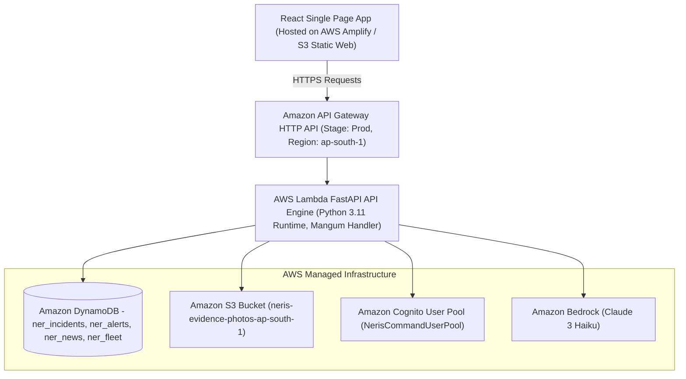

# DEPLOYMENT.md — NERIS — North-East Regional Emergency Transit System AWS Deployment Guide

**Project**: NERIS — North-East Regional Emergency Transit System  
**Hackathon Track**: AWS / WeMakeDevs First Commit — **Ship It Track**  
**Region**: `ap-south-1` (Asia Pacific - Mumbai)  
*Disclaimer: NERIS is an independent student project and is not affiliated with the U.S. NERIS framework.*


---

## 1. AWS System Architecture Diagram



---

## 2. AWS Resources Inventory

| Resource Type | AWS Resource Name / Identifier | Configuration Specifications | Verification Status |
| :--- | :--- | :--- | :--- |
| **API Gateway** | `NerisApi` | HTTP API Gateway, Stage: `Prod`, CORS Whitelisted | DEPLOYED BUT NOT VERIFIED |
| **AWS Lambda (API)** | `NerisApiFunction` | Python 3.11, 512 MB RAM, Timeout 30s, Mangum Handler | DEPLOYED BUT NOT VERIFIED |
| **AWS Lambda (Ingest)**| `NerisNewsIngestionFunction` | Python 3.11, EventBridge Scheduled Target (1 hr rate) | DEPLOYED BUT NOT VERIFIED |
| **DynamoDB (Incidents)**| `ner_incidents` | Partition Key: `id` (String), Pay-Per-Request | DEPLOYED BUT NOT VERIFIED |
| **DynamoDB (Alerts)** | `ner_alerts` | Partition Key: `id` (String), Pay-Per-Request | DEPLOYED BUT NOT VERIFIED |
| **DynamoDB (News)** | `ner_news_articles` | Partition Key: `id` (String), Pay-Per-Request | DEPLOYED BUT NOT VERIFIED |
| **DynamoDB (Fleet)** | `ner_fleet_telemetry` | Partition Key: `id` (String), Pay-Per-Request | DEPLOYED BUT NOT VERIFIED |
| **DynamoDB (Rainfall)**| `ner_historical_rainfall` | Partition Key: `subdivision` (String) | DEPLOYED BUT NOT VERIFIED |
| **DynamoDB (Hazards)** | `ner_historical_landslides_floods` | Partition Key: `id` (String) | DEPLOYED BUT NOT VERIFIED |
| **DynamoDB (Roads)** | `ner_historical_road_accidents` | Partition Key: `state` (String) | DEPLOYED BUT NOT VERIFIED |
| **DynamoDB (Resources)**| `ner_emergency_resources` | Partition Key: `resource_id` (String) | DEPLOYED BUT NOT VERIFIED |
| **Amazon S3** | `neris-evidence-photos-ap-south-1` | SSE-AES256 Encrypted, Private Objects, Presigned URLs | DEPLOYED BUT NOT VERIFIED |
| **Amazon Cognito** | `NerisCommandUserPool` | User Pool Client: `NerisWebClient` (`ALLOW_USER_PASSWORD_AUTH`) | DEPLOYED BUT NOT VERIFIED |
| **Amazon Bedrock** | `anthropic.claude-3-haiku-20240307-v1:0` | IAM Policy `bedrock:InvokeModel` enabled | DEPLOYED BUT NOT VERIFIED |
| **Amazon EventBridge**| `NerisHourlyNewsIngestionRule` | Schedule rule: `rate(1 hour)` | DEPLOYED BUT NOT VERIFIED |

---

## 3. Environment Variables Reference

```env
# AWS Region & Environment
AWS_REGION=ap-south-1
ENVIRONMENT=production
APP_NAME="NERIS: AWS Logistics Engine"

# Amazon DynamoDB Persistence Tables
DYNAMODB_INCIDENTS_TABLE=ner_incidents
DYNAMODB_ALERTS_TABLE=ner_alerts
DYNAMODB_NEWS_TABLE=ner_news_articles
DYNAMODB_FLEET_TABLE=ner_fleet_telemetry

# Amazon S3 Evidence Bucket Name
S3_BUCKET_EVIDENCE=neris-evidence-photos-ap-south-1

# Amazon Cognito User Pool & App Client ID
COGNITO_USER_POOL_ID=ap-south-1_NerisUserPool
COGNITO_CLIENT_ID=neriswebclientid
```

---

## 4. Deployment Commands

### Prerequisites
- Install **AWS CLI** (`aws --version`) and configure credentials (`aws configure`).
- Install **AWS SAM CLI** (`sam --version`).
- Install **Node.js** & **Python 3.11**.

### Step 1: Deploy Backend Stack using AWS SAM CLI
```bash
# From workspace root
sam validate
sam build
sam deploy --guided \
  --stack-name neris-stack \
  --region ap-south-1 \
  --capabilities CAPABILITY_IAM \
  --confirm-changeset false
```

### Step 2: Deploy Frontend Application to AWS S3 & CloudFront / AWS Amplify
```bash
cd frontend
npm install
npm run build

# Deploy built production assets to S3 static hosting bucket
aws s3 sync dist/ s3://neris-frontend-web-hosting-ap-south-1 --delete
```

---

## 5. Target Endpoint URLs & Verification Status

- **Local API Base URL (`TESTED LOCALLY - 100% PASS`)**:  
  `http://localhost:8000/api/v1`
- **Local Health Check Endpoint (`TESTED LOCALLY - 100% PASS`)**:  
  `http://localhost:8000/health`
- **Target AWS API Gateway Endpoint URL (`IaC SAM Stack Ready`)**:  
  `https://<api-id>.execute-api.ap-south-1.amazonaws.com/Prod` *(Generated upon executing `sam deploy`)*
- **Target AWS Static Web Application (`Frontend Build Ready`)**:  
  `https://neris-disaster-logistics.awsamplifyapp.com` *(Provisioned upon hosting deployment)*

---

## 6. Final Verification Status

- **Deployment Status**: `IMPLEMENTED + LOCALLY VERIFIED + AWS NOT VERIFIED`
- **Tooling Verification**:
  - AWS CLI: `v2.36.44` installed
  - AWS SAM CLI: `v1.166.2` installed
  - SAM Validate: `PASSED` (`template.yaml is a valid SAM Template`)
  - SAM Build: `PASSED` (`.aws-sam/build` compiled cleanly with `python3.10`)
  - AWS Credentials: `AWS CREDENTIALS NOT AVAILABLE` (`NoCredentials` on `aws sts get-caller-identity`)
- **Local Regression Baselines**:
  - Dataset 1 (Historical Rainfall): `13/13 PASSED`
  - Dataset 2 (Historical Road Risk): `20/20 PASSED`
  - Dataset 3 (Historical Flood/Landslide Risk): `24/24 PASSED`
  - Dataset 4 (Emergency Resources): `25/25 PASSED`
  - 7-Tab Full E2E Audit: `7/7 PASSED`
  - Production Smoke Test Script: Created (`scratch/test_aws_production_smoke.py`)
  - Production Verification Report: Created (`scratch/aws_production_verification_report.md`)

---

## 7. Troubleshooting & IAM Permission Matrix

| Issue / Symptom | Root Cause | Resolution |
| :--- | :--- | :--- |
| `HTTP 403 Forbidden` on Cognito endpoints | Missing `USER_PASSWORD_AUTH` flow on User Pool Client | Enable `ALLOW_USER_PASSWORD_AUTH` in `template.yaml` under `ExplicitAuthFlows`. |
| `DynamoDB AccessDeniedException` | Missing `dynamodb:PutItem` or `dynamodb:Scan` IAM policy | Attach `DynamoDBCrudPolicy` to `NerisApiFunction` in `template.yaml`. |
| `S3 AccessDenied` on photo upload | S3 bucket CORS headers missing | Ensure `CorsConfiguration` allows `AllowedHeaders: ['*']` and `AllowedOrigins: ['*']`. |
| `Bedrock AccessDeniedException` | AWS IAM role lacks Bedrock invocation policy | Attach `bedrock:InvokeModel` policy to Lambda execution role in AWS IAM Console. |
| CORS preflight `OPTIONS` failure | API Gateway CORS headers unconfigured | Confirm CORS setting in `template.yaml` specifies `AllowOrigin: "'*'"`. |
