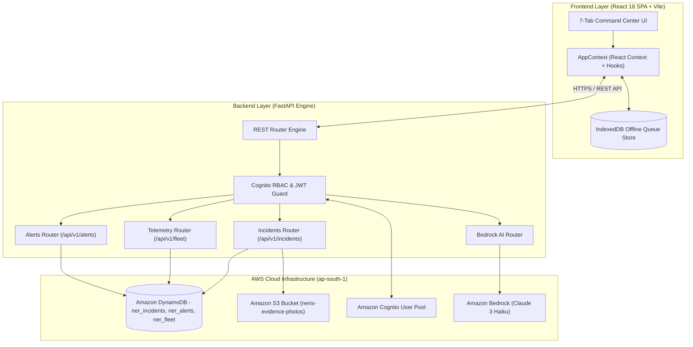
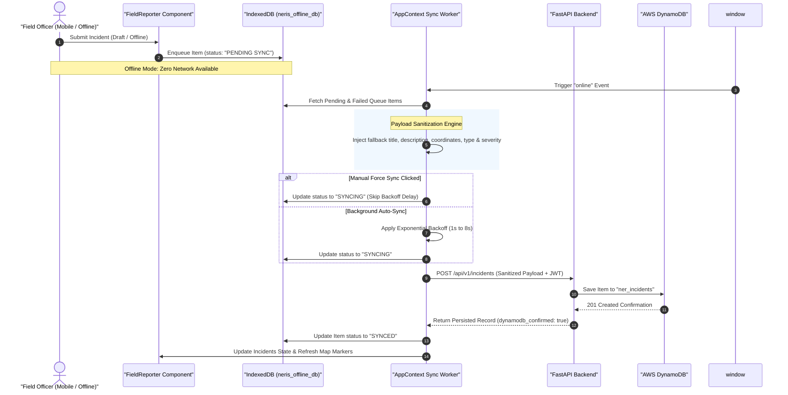
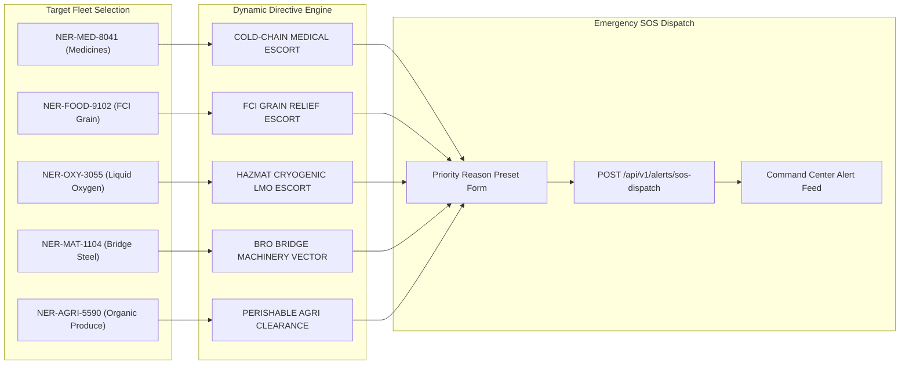
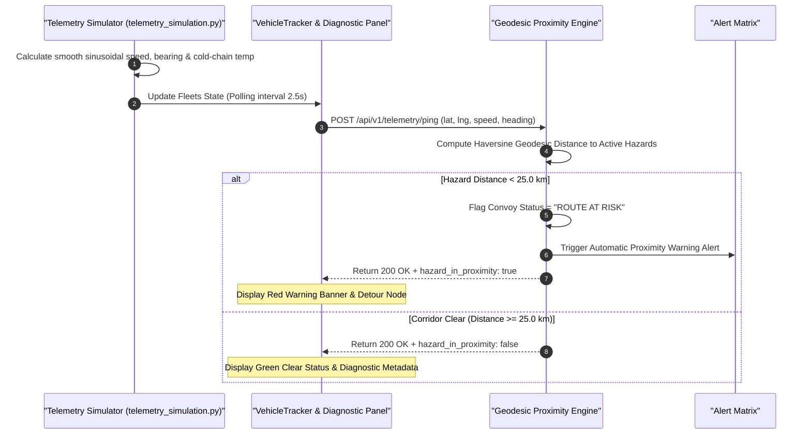
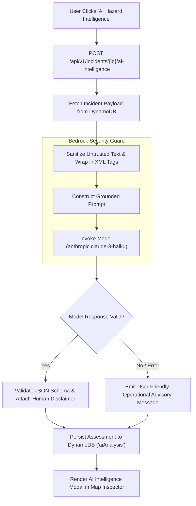
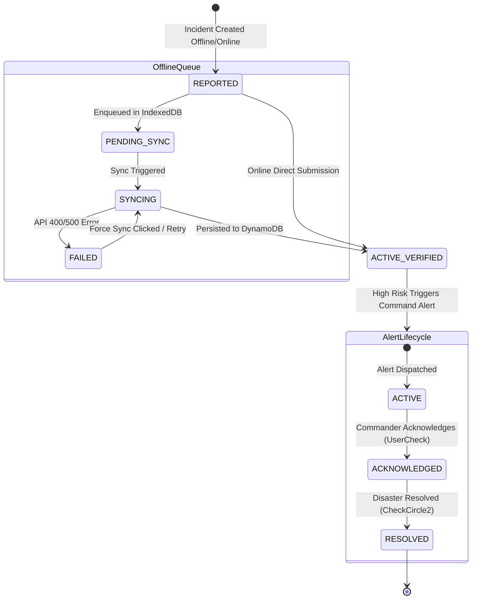
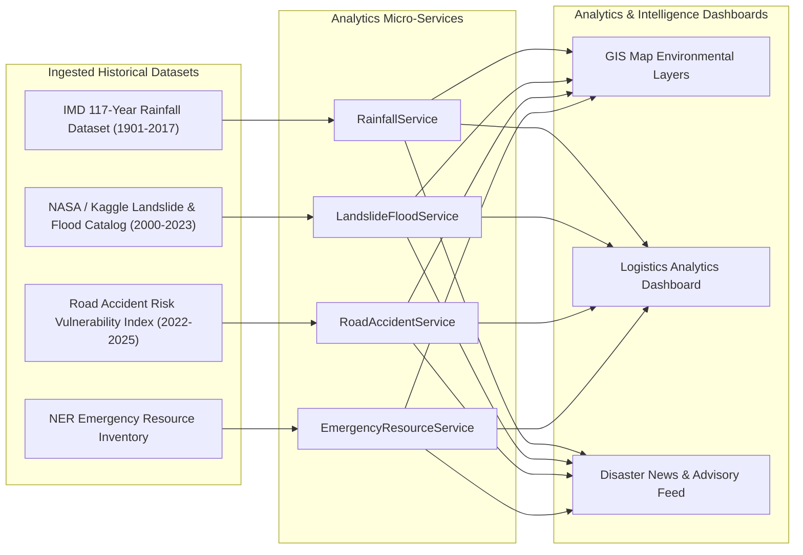

# 🗺️ NERIS System Architecture & Technical Documentation

> **Project**: NERIS — North-East Regional Emergency Transit System  
> **Deployment Region**: `ap-south-1` (AWS Asia Pacific - Mumbai)  
> **Frameworks**: React 18 SPA + Vite | Python 3.11 + FastAPI  
> **Cloud Provider**: Amazon Web Services (AWS Serverless)  
> **Disclaimer**: Independent student emergency logistics project.

---

## 📋 Table of Contents
1. [High-Level System Architecture](#1-high-level-system-architecture)
2. [Offline-First Incident Sync & Payload Pipeline](#2-offline-first-incident-sync--payload-pipeline)
3. [Target Fleet SOS Emergency Vectoring Workflow](#3-target-fleet-sos-emergency-vectoring-workflow)
4. [Real-Time Telemetry & Geodesic Hazard Intercept](#4-real-time-telemetry--geodesic-hazard-intercept)
5. [Amazon Bedrock AI Incident Intelligence Pipeline](#5-amazon-bedrock-ai-incident-intelligence-pipeline)
6. [Incident & Alert Lifecycle State Machine](#6-incident--alert-lifecycle-state-machine)
7. [Multi-Source Historical Analytics & Data Ingestion](#7-multi-source-historical-analytics--data-ingestion)

---

## 1. High-Level System Architecture

The **NERIS Platform** decouples client rendering, offline persistence, backend REST execution, cloud database storage, identity management, and artificial intelligence into dedicated, resilient modules.

---

## 2. Offline-First Incident Sync & Payload Pipeline

When field officers operate in zero-connectivity mountain zones, reports are enqueued into browser **IndexedDB**. Once network access is restored, payloads are sanitized and synchronized with automatic backoff delays for auto-sync and instant execution for manual force-sync.

---

## 3. Target Fleet SOS Emergency Vectoring Workflow

Logistics Commanders can dispatch emergency SDRF, military, and BRO priority escorts tailored specifically to target fleet cargo requirements.

---

## 4. Real-Time Telemetry & Geodesic Hazard Intercept

Continuous GPS telemetry pings monitor fleet coordinates against active hazard locations using geodesic distance math.

---

## 5. Amazon Bedrock AI Incident Intelligence Pipeline

AI incident evaluations use prompt sanitization and XML input tagging to ensure safety and factual grounding without exposing technical errors.

---

## 6. Incident & Alert Lifecycle State Machine

---

## 7. Multi-Source Historical Analytics & Data Ingestion

---

## 📁 Key File Map

| System Component | File Location | Purpose |
|---|---|---|
| **GIS Map** | [`GISMap.jsx`](file:///c:/Users/Lenovo/OneDrive/Desktop/New%20folder/frontend/src/components/GISMap.jsx) | Interactive Leaflet GIS map with incident popups & AI modals |
| **Fleet Tracker** | [`VehicleTracker.jsx`](file:///c:/Users/Lenovo/OneDrive/Desktop/New%20folder/frontend/src/components/VehicleTracker.jsx) | Live convoy telemetry tracking & diagnostic stream inspector |
| **Alert Matrix** | [`AlertCenter.jsx`](file:///c:/Users/Lenovo/OneDrive/Desktop/New%20folder/frontend/src/components/AlertCenter.jsx) | Command alerts, target fleet SOS vectors & operational advisories |
| **Field Reporter** | [`FieldReporter.jsx`](file:///c:/Users/Lenovo/OneDrive/Desktop/New%20folder/frontend/src/components/FieldReporter.jsx) | Field incident reporting form & IndexedDB offline queue manager |
| **State Context** | [`AppContext.jsx`](file:///c:/Users/Lenovo/OneDrive/Desktop/New%20folder/frontend/src/context/AppContext.jsx) | Global React context, offline sync worker & simulated telemetry polling |
| **API Client** | [`api.js`](file:///c:/Users/Lenovo/OneDrive/Desktop/New%20folder/frontend/src/services/api.js) | Frontend REST client with error sanitization & Cognito auth headers |
| **Bedrock Adapter** | [`aws_bedrock.py`](file:///c:/Users/Lenovo/OneDrive/Desktop/New%20folder/backend/app/adapters/aws_bedrock.py) | Amazon Bedrock Claude 3 Haiku adapter with prompt security controls |
| **Alert Service** | [`alert_service.py`](file:///c:/Users/Lenovo/OneDrive/Desktop/New%20folder/backend/app/services/alert_service.py) | Risk evaluation engine & persistent alert dispatch |
