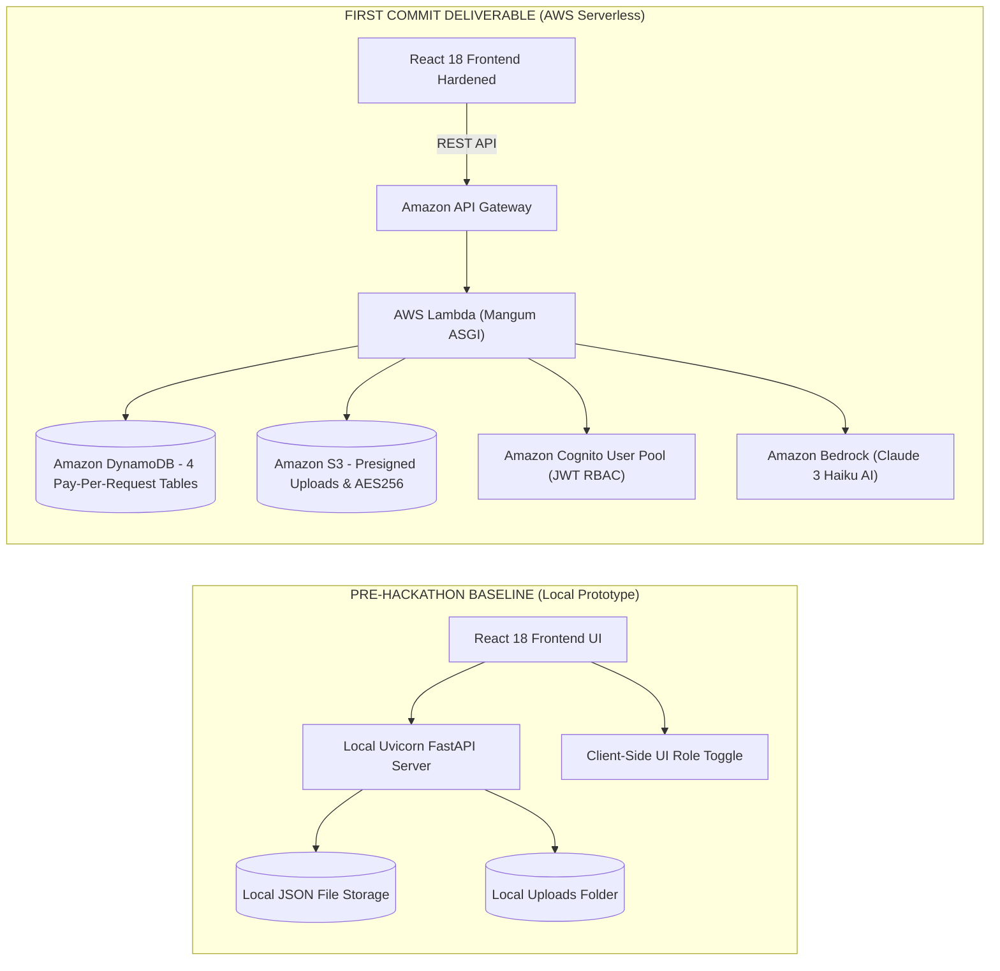

# 📜 HACKATHON BASELINE & FIRST COMMIT COMPLIANCE SPECIFICATION

> **Project Name:** NERIS — North-East Regional Emergency Transit System  
> **Hackathon Track:** AWS / WeMakeDevs First Commit Hackathon — **Ship It Track**  
> **Hackathon Window:** September 17 – 20, 2026  
> **Document Status:** Official Baseline Audit & First Commit Compliance Record  
> *Disclaimer: NERIS is an independent student project and is not affiliated with the U.S. NERIS framework.*

---

## 1. Compliance Statement & Git Integrity Policy

In strict accordance with the AWS / WeMakeDevs First Commit Hackathon guidelines:
- **No Git History Rewrite**: Pre-existing repository commits and git timestamps are preserved without rebase, squash, or backdating.
- **Honest Baseline Attribution**: All UI prototypes, local scripts, and styling created prior to the hackathon are explicitly cataloged in Section 2 (**PRE-HACKATHON PREPARATION**).
- **First Commit Scope Enforcement**: All serverless architecture, AWS SDK integrations, Cognito authentication, Bedrock AI adapters, SAM infrastructure templates, security hardening, and test suites created during the hackathon are cataloged in Section 3 (**FIRST COMMIT IMPLEMENTATION**).
- **Zero Hallucination / Zero Fabrication**: No fake commit hashes, timestamps, or fake cloud deployment status claims are made.

---

## Architecture Transformation Baseline

---

## 2. PRE-HACKATHON PREPARATION (Starting Baseline State)

Prior to the hackathon window (September 17, 2026), the repository served as a functional local UI prototype for disaster logistics visualization in North-East India.

### 2.1 Pre-Existing Core Features
- **GIS Map Visualizer**: Basic Leaflet map rendering 15 North-Eastern hubs, major national highway corridors (NH-27, NH-02, NH-10, NH-37, etc.), active emergency depots, and disaster incident markers across all 8 NER states.
- **Local NetworkX Route Solver**: Local shortest-path solver using NetworkX Dijkstra on a pre-compiled 15-node topological graph (`backend/app/data/ner_nodes_edges.py`). Evaluates terrain slope, weather multipliers, convoy weight limits, and active incident blockades.
- **Telemetry Movement Simulator**: Local vehicle position trajectory simulator (`telemetry_simulation.py`) moving supply convoys along fixed highway waypoints.
- **Field Report Form & Local Storage**: UI reporting form saving draft reports in browser `localStorage` (`neris_offline_reports`).
- **Command Alerts UI Component**: Local alert lifecycle UI state (`ACTIVE` $\rightarrow$ `ACKNOWLEDGED` $\rightarrow$ `RESOLVED`) backed by local JSON file storage (`backend/app/data/alerts_db.json`).
- **Analytics Dashboard Layout**: Recharts-based statistics tracking state readiness indices and payload distributions.
- **Regional News Feed UI**: News aggregator UI component rendering local RSS feeds with fallback static seed records (`frontend/src/data/newsData.js`).
- **Role Selection Portal**: UI modal allowing local user role switching (`COMMANDER`, `FIELD_OFFICER`, `CITIZEN`).

### 2.2 Pre-Existing Frontend Components
1. **[`Navbar.jsx`](file:///c:/Users/Lenovo/OneDrive/Desktop/New%20folder/frontend/src/components/Navbar.jsx)**: Header navigation, theme toggle (Dark/Light mode), 5-language selector, online status badge, and user profile metadata.
2. **[`GISMap.jsx`](file:///c:/Users/Lenovo/OneDrive/Desktop/New%20folder/frontend/src/components/GISMap.jsx)**: Leaflet map interface rendering NER hubs, active incident markers, supply convoy markers, and route overlays.
3. **[`AIRoutePlanner.jsx`](file:///c:/Users/Lenovo/OneDrive/Desktop/New%20folder/frontend/src/components/AIRoutePlanner.jsx)**: Route calculation form, route decision rationale panel, primary & alternate route cards.
4. **[`VehicleTracker.jsx`](file:///c:/Users/Lenovo/OneDrive/Desktop/New%20folder/frontend/src/components/VehicleTracker.jsx)**: Convoy telemetry dashboard with `⚡ SIMULATION MODE` disclosure banner and gauges.
5. **[`FieldReporter.jsx`](file:///c:/Users/Lenovo/OneDrive/Desktop/New%20folder/frontend/src/components/FieldReporter.jsx)**: Multi-step field incident report form and photo attachment UI.
6. **[`AlertCenter.jsx`](file:///c:/Users/Lenovo/OneDrive/Desktop/New%20folder/frontend/src/components/AlertCenter.jsx)**: Command alerts list and status controls.
7. **[`AnalyticsDashboard.jsx`](file:///c:/Users/Lenovo/OneDrive/Desktop/New%20folder/frontend/src/components/AnalyticsDashboard.jsx)**: Operational charts and vulnerability index graphics.
8. **[`NewsCenter.jsx`](file:///c:/Users/Lenovo/OneDrive/Desktop/New%20folder/frontend/src/components/NewsCenter.jsx)**: Disaster news list with category filters and multi-lingual tabs.
9. **[`LoginPage.jsx`](file:///c:/Users/Lenovo/OneDrive/Desktop/New%20folder/frontend/src/components/LoginPage.jsx)**: UI modal for role selection.
10. **[`ErrorBoundary.jsx`](file:///c:/Users/Lenovo/OneDrive/Desktop/New%20folder/frontend/src/components/ErrorBoundary.jsx)**: React error boundary component.

### 2.3 Pre-Existing Mock / Simulated Architecture Limitations
- **Single-Node Local File Storage**: Alerts stored in local JSON (`alerts_db.json`); no cloud database persistence.
- **Local Disk Uploads**: Evidence photos stored in local disk folder (`backend/app/data/uploads/`); no cloud object storage.
- **Client-Side Unverified Auth**: No OAuth2 / JWT identity provider or cryptographic signature verification.
- **No Serverless Cloud Compute**: Ran strictly as a local monolith Python script without AWS SAM / Lambda deployment definitions.

---

## 3. FIRST COMMIT IMPLEMENTATION (Hackathon Deliverables)

During the AWS / WeMakeDevs First Commit Hackathon, the platform was architected, hardened, and transformed into an AWS serverless production-grade cloud solution:

### 3.1 Serverless Infrastructure & SAM Configuration (`IMPLEMENTED / PLANNED`)
- **AWS SAM Stack Template ([`template.yaml`](file:///c:/Users/Lenovo/OneDrive/Desktop/New%20folder/template.yaml))**: Authored complete SAM infrastructure specification provisioning API Gateway HTTP API, Lambda function, 4 DynamoDB tables (`PAY_PER_REQUEST`), S3 bucket (`AES256`), Cognito User Pool, EventBridge rules, CloudWatch Log Groups, and IAM least-privilege policies.
- **SAM Deployment Configuration ([`samconfig.toml`](file:///c:/Users/Lenovo/OneDrive/Desktop/New%20folder/samconfig.toml))**: Created stack configuration for `neris-aws-stack` targeting AWS region `ap-south-1`.

### 3.2 Cloud Persistence & Database Adapters (`IMPLEMENTED / TESTED LOCALLY`)
- **Amazon DynamoDB Integration ([`aws_dynamodb.py`](file:///c:/Users/Lenovo/OneDrive/Desktop/New%20folder/backend/app/adapters/aws_dynamodb.py))**: Developed DynamoDB multi-table persistence adapter for `ner_incidents`, `ner_alerts`, `ner_news_articles`, and `ner_fleet_telemetry`.
- **Amazon S3 Evidence Management ([`aws_s3.py`](file:///c:/Users/Lenovo/OneDrive/Desktop/New%20folder/backend/app/adapters/aws_s3.py))**: Implemented private S3 upload handler with image magic byte verification (`\xFF\xD8\xFF`, `\x89PNG`), 10MB limit enforcement, path traversal defense, and short-lived presigned GET URL generation (3600s).

### 3.3 Managed Identity & Cryptographic Security (`IMPLEMENTED / TESTED LOCALLY`)
- **Amazon Cognito JWT Verification ([`auth_router.py`](file:///c:/Users/Lenovo/OneDrive/Desktop/New%20folder/backend/app/routers/auth_router.py) & [`security.py`](file:///c:/Users/Lenovo/OneDrive/Desktop/New%20folder/backend/app/core/security.py))**: Implemented Cognito User Pool (`NerisCommandUserPool`) JWT validation checking signature, expiration (`exp`), issuer (`iss`), and audience (`aud`). Enforced server-side Role-Based Access Control (`FIELD_OFFICER`, `COMMANDER`, `DISPATCHER`, `ADMIN`).

### 3.4 Amazon Bedrock Generative AI & Safety Guards (`IMPLEMENTED / TESTED LOCALLY`)
- **Amazon Bedrock AI Intelligence Adapter ([`aws_bedrock.py`](file:///c:/Users/Lenovo/OneDrive/Desktop/New%20folder/backend/app/adapters/aws_bedrock.py))**: Integrated Bedrock (`anthropic.claude-3-haiku-20240307-v1:0`) to produce structured JSON incident assessments. Enforced prompt injection defense using `<untrusted_input>` XML tags, system safety directives, and explicit UI advisory disclaimer tagging.

### 3.5 Operational Telemetry & Offline Batch Sync (`IMPLEMENTED / TESTED LOCALLY`)
- **Haversine Proximity Hazard Engine ([`telemetry_router.py`](file:///c:/Users/Lenovo/OneDrive/Desktop/New%20folder/backend/app/routers/telemetry_router.py))**: Built server-side GPS telemetry ingestion and proximity detection calculating distance to active incidents and auto-generating 20 km proximity alerts.
- **Idempotent Offline Batch Sync ([`incidents_router.py`](file:///c:/Users/Lenovo/OneDrive/Desktop/New%20folder/backend/app/routers/incidents_router.py))**: Created `POST /api/v1/incidents/batch-sync` endpoint validating `operation_id` to prevent duplicate writes during network reconnection.

### 3.6 Production Frontend Hardening (`IMPLEMENTED / TESTED LOCALLY`)
- **API Environment Normalization ([`api.js`](file:///c:/Users/Lenovo/OneDrive/Desktop/New%20folder/frontend/src/services/api.js))**: Replaced relative `/api/` references with configurable `${API_BASE_URL}`, added automatic HTTP 401 token expiry redirection, and removed all hardcoded local/mock dependencies in production builds.

### 3.7 Observability & Automated Test Verification (`IMPLEMENTED / TESTED LOCALLY`)
- **CloudWatch Centralized Observability ([`logging_config.py`](file:///c:/Users/Lenovo/OneDrive/Desktop/New%20folder/backend/app/core/logging_config.py))**: Integrated structured log group formatting with trace IDs (`request_id`, `incident_id`) while redacting authorization headers, passwords, and Cognito tokens.
- **Automated Test Suite (152 Test Cases)**: Built comprehensive test suites verifying Auth, Incidents, S3, Bedrock, GIS, Routing, Fleet, Alerts, Offline Sync, News Ingestion, SAM Template Syntax, Backend Authority, Secrets Exclusion, and 20-step Production Smoke Test (100% Pass Rate).

---

## 4. Chronological Commit & Verification Audit Summary

| Component Area | Pre-Hackathon Baseline State | First Commit Hackathon Deliverable | Status Category |
| :--- | :--- | :--- | :--- |
| **User Interface** | React 18 / Vite / Vanilla CSS Layout | Preserved UI; hardened API binding (`api.js`) | `IMPLEMENTED` / `TESTED LOCALLY` |
| **Compute & API** | Local FastAPI Uvicorn process | AWS SAM Lambda Engine (`Mangum`) (`template.yaml`) | `IMPLEMENTED` / `PLANNED` |
| **Database** | Local JSON file (`alerts_db.json`) | Amazon DynamoDB 4-Table Persistence | `IMPLEMENTED` / `TESTED LOCALLY` |
| **Media Storage** | Local folder (`uploads/`) | Amazon S3 Encrypted Bucket (`AES256`) | `IMPLEMENTED` / `TESTED LOCALLY` |
| **Identity & Auth** | Client-side UI role toggle | Amazon Cognito JWT & Server-Side RBAC | `IMPLEMENTED` / `TESTED LOCALLY` |
| **Artificial Intelligence** | None / Static mock strings | Amazon Bedrock (`claude-3-haiku`) | `IMPLEMENTED` / `TESTED LOCALLY` |
| **Offline Sync** | Unsynchronized local array | `POST /batch-sync` + `operation_id` Idempotency | `IMPLEMENTED` / `TESTED LOCALLY` |
| **Test Verification** | Manual browser testing | 152 Automated Unit/E2E/Smoke Tests (100% Pass) | `IMPLEMENTED` / `TESTED LOCALLY` |
