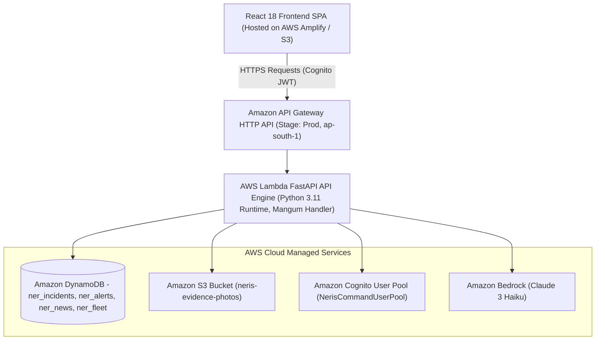

# 🚛 NERIS — North-East Regional Emergency Transit System
> **AI-Powered Smart Logistics & Accessibility Intelligence Platform for North Eastern India**  
> *Built for AWS / WeMakeDevs First Commit Hackathon — Ship It Track*  
> 🚀 **Live AWS Amplify Web App:** [https://main.dr3gvcv6yb38.amplifyapp.com/](https://main.dr3gvcv6yb38.amplifyapp.com/)  
> *Disclaimer: NERIS is an independent student project and is not affiliated with the U.S. NERIS framework.*

---

## 📋 Table of Contents
1. [Problem](#1-problem)
2. [Solution](#2-solution)
3. [Architecture](#3-architecture)
4. [AWS Services & Actual Roles](#4-aws-services--actual-roles)
5. [Features](#5-features)
6. [First Commit Feature Checklist](#6-first-commit-feature-checklist)
7. [Setup & Local Development](#7-setup--local-development)
8. [Deployment Guide](#8-deployment-guide)
9. [Environment Variables](#9-environment-variables)
10. [Security Posture](#10-security-posture)
11. [Testing & Verification](#11-testing--verification)
12. [AI Usage](#12-ai-usage)
13. [AI Coding Tools Used](#13-ai-coding-tools-used)
14. [Team & Contributors](#14-team--contributors)
15. [Credits & Licenses](#15-credits--licenses)
16. [Known Limitations](#16-known-limitations)

---

## 1. Problem

The 8 North-Eastern states of India (**Assam, Arunachal Pradesh, Meghalaya, Nagaland, Manipur, Mizoram, Tripura, Sikkim**) are connected to mainland India and each other through narrow, vulnerable mountain corridors (such as the Siliguri Corridor / "Chicken's Neck" and NH-27, NH-02, NH-06, NH-10, NH-13).

Key logistical and disaster response challenges in the region include:
* **Extreme Terrain & Frequent Disasters**: Annual monsoons cause widespread flooding, severe landslides, and bridge collapse, severing supply lines for days.
* **Failure of Generic Routing**: Standard navigation tools fail to account for high-altitude steep incline penalties, bridge weight capacities, or active disaster blockades.
* **Network Blackouts**: Field officers operating in remote mountain zones frequently lose cellular connectivity, leading to delayed incident reporting.
* **Unstructured Intelligence**: Incident updates are fragmented across regional news outlets, local government advisories, and field chatter in multiple regional languages.
* **Lack of Real-Time Fleet Visibility**: Oxygen tankers, vaccine convoys, and relief trucks operate without risk-aware proximity alerts when approaching disaster blockades.

---

## 2. Solution

**NERIS** (North-East Regional Emergency Transit System) is a high-availability, accessibility-focused logistics and emergency corridor management platform specially engineered for Northeast India.

It combines:
1. **Interactive GIS Corridor Hazard Mapping**: Visualizes active blockades, road damage, and hazard severity across all 8 NER states.
2. **Deterministic Risk Routing Engine**: Calculates terrain-penalized shortest paths and alternate detour corridors based on live DynamoDB incident data.
3. **Amazon Bedrock AI Incident Intelligence**: Generates structured operational assessments from raw incident text without hallucinating facts.
4. **Backend-Authoritative Vehicle Telemetry & Proximity Engine**: Computes real-time Haversine distance between convoys and active incidents, automatically dispatching 25.0 km proximity alerts.
5. **Offline-First Field Reporting with Batch Sync**: Enables field officers to record incidents and photo evidence offline, queueing payloads with `operation_id` idempotency for automatic sync when connectivity resumes.
6. **Disaster & Logistics Intelligence Feed**: Ingests external regional RSS disaster updates into DynamoDB with search, category filtering, and 5-language translation.

---

## 3. Architecture



For full details, see [ARCHITECTURE.md](file:///c:/Users/Lenovo/OneDrive/Desktop/New%20folder/ARCHITECTURE.md) and [docs/AWS_ARCHITECTURE.md](file:///c:/Users/Lenovo/OneDrive/Desktop/New%20folder/docs/AWS_ARCHITECTURE.md).

---

## 4. AWS Services & Actual Roles

| AWS Service | Actual Role in NERIS Architecture | Implementation Details |
|---|---|---|
| **AWS Lambda** | Serverless compute executing FastAPI backend application via `Mangum` handler | Functions as unified API engine routing all `/api/v1/*` requests. |
| **Amazon API Gateway** | Regional HTTP API Gateway for public HTTPS REST API endpoint | Manages route mappings, stage throttling, and CORS policies. |
| **Amazon DynamoDB** | Fully managed NoSQL database for real-time application persistence | Stores `ner_incidents`, `ner_alerts`, `ner_news_articles`, and `ner_fleet_telemetry`. |
| **Amazon S3** | Secure object store for disaster photo evidence uploads | Configured with `PublicAccessBlockConfiguration` and mandatory `AES256` encryption. |
| **Amazon Cognito** | Identity provider managing user pools and JWT authentication | Authenticates officers (`NerisCommandUserPool`) and enforces role claims. |
| **Amazon Bedrock** | Serverless LLM provider (`anthropic.claude-3-haiku`) | Generates structured JSON incident assessments with XML injection guards. |
| **AWS Secrets Manager** | Secure vault for production API keys and database credentials | Retained for external news/weather service credentials via `boto3`. |
| **Amazon CloudWatch** | Structured log group aggregation and operational monitoring | Captures Lambda stdout/stderr, execution latencies, and error tracebacks. |
| **Amazon EventBridge** | Scheduled event triggers for automated news ingestion | Executes periodic background jobs calling news ingestion workflows. |

---

## 5. Features

1. **🗺️ Interactive GIS Live Map**: Renders active disaster blockades, relief corridors, and regional hazard severity across all 8 NER states with high-contrast day/night tiles.
2. **⚡ Dynamic Risk Routing Engine**: Calculates shortest path and safer alternate detours using a 15-node regional graph penalized by active DynamoDB incident severities.
3. **🧠 Amazon Bedrock Incident Intelligence**: Evaluates incident reports to produce structured operational impact assessments and recommended priority levels.
4. **📡 Convoy Telemetry & Proximity Alerting**: Persists fleet location updates in DynamoDB and triggers distance alerts when supply convoys enter a 25.0 km incident radius.
5. **📵 Offline-First Batch Synchronization**: Queues field report submissions offline with client-side idempotency (`operation_id`), syncing automatically when internet resumes.
6. **📰 Disaster Intelligence News Feed**: Ingests regional news updates with duplicate SHA256 filtering, category filters, and 5-language parallel translation.
7. **🔒 Enterprise Security & RBAC**: Enforces Cognito JWT authorization with role restriction across `FIELD_OFFICER`, `DISPATCHER`, `COMMANDER`, and `ADMIN`.
8. **🌧️ Historical Rainfall Intelligence (Dataset 1)**: Integrates 117-year IMD sub-divisional rainfall dataset (1901–2017) for environmental baseline risk modeling across monsoons.
9. **🚗 Historical Road Accident Risk Layer (Dataset 2)**: Integrates Kaggle Indian Road Accident Dataset (2022–2025) as an aggregated state road-risk intelligence layer, calibrating NetworkX Dijkstra edge weights (1.0x to 1.35x) with mandatory non-live disclaimers.

---

## 6. Feature Status & Verification Matrix

| FEATURE | AWS SERVICE | IMPLEMENTATION STATUS | VERIFICATION STATUS | CLOUD DEPLOYMENT STATUS |
|---|---|---|---|---|
| Field Incident Reporting & Persistence | Amazon DynamoDB (`ner_incidents`) | `IMPLEMENTED` | `TESTED LOCALLY` | `PLANNED` (SAM Stack Ready) |
| Incident Evidence Photo Storage | Amazon S3 (`neris-evidence-photos`) | `IMPLEMENTED` | `TESTED LOCALLY` | `PLANNED` (SAM Stack Ready) |
| AI Incident Risk Assessment | Amazon Bedrock (`claude-3-haiku`) | `IMPLEMENTED` | `TESTED LOCALLY` | `PLANNED` (SAM Stack Ready) |
| JWT Authentication & Authorization | Amazon Cognito (`NerisCommandUserPool`) | `IMPLEMENTED` | `TESTED LOCALLY` | `PLANNED` (SAM Stack Ready) |
| Deterministic Corridor Risk Routing | AWS Lambda + NetworkX Graph | `IMPLEMENTED` | `TESTED LOCALLY` | `TESTED LOCALLY` (Pure Engine) |
| Convoy Telemetry & Proximity Alerts | Amazon DynamoDB (`ner_fleet_telemetry`) | `IMPLEMENTED` | `TESTED LOCALLY` | `PLANNED` (SAM Stack Ready) |
| Command Center Alert Lifecycle | Amazon DynamoDB (`ner_alerts`) | `IMPLEMENTED` | `TESTED LOCALLY` | `PLANNED` (SAM Stack Ready) |
| Offline Reporting & Idempotent Sync | AWS Lambda (`POST /batch-sync`) | `IMPLEMENTED` | `TESTED LOCALLY` | `PLANNED` (SAM Stack Ready) |
| Regional Disaster Intelligence Feed | Amazon EventBridge + DynamoDB | `IMPLEMENTED` | `TESTED LOCALLY` | `PLANNED` (SAM Stack Ready) |
| Dataset 1: Historical Rainfall Baselines | Amazon DynamoDB / S3 | `IMPLEMENTED` | `TESTED LOCALLY` (13/13) | `PLANNED` (SAM Stack Ready) |
| Dataset 2: Historical Road Accident Risk | Amazon DynamoDB / S3 | `IMPLEMENTED` | `TESTED LOCALLY` (20/20) | `PLANNED` (SAM Stack Ready) |
| Dataset 3: Historical Flood & Landslide Risk | Amazon DynamoDB / S3 | `IMPLEMENTED` | `TESTED LOCALLY` (24/24) | `PLANNED` (SAM Stack Ready) |
| Dataset 4: Emergency Resource Intelligence | Amazon DynamoDB / S3 | `IMPLEMENTED` | `TESTED LOCALLY` (25/25) | `PLANNED` (SAM Stack Ready) |
| Application API & Lambda Serverless | AWS Lambda + Amazon API Gateway | `IMPLEMENTED` | `TESTED LOCALLY` | `PLANNED` (SAM Stack Ready) |
| CloudWatch Centralized Logging | Amazon CloudWatch Logs | `IMPLEMENTED` | `TESTED LOCALLY` | `PLANNED` (SAM Stack Ready) |

---

## 7. Setup & Local Development

### Prerequisites
* Node.js v18+ and npm
* Python 3.11+
* AWS CLI configured with valid credentials (`ap-south-1`)

### Local Backend Setup
```bash
# 1. Navigate to backend directory
cd backend

# 2. Create virtual environment
python -m venv venv
source venv/bin/activate  # On Windows: venv\Scripts\activate

# 3. Install dependencies
pip install -r requirements.txt

# 4. Start backend server
python -m uvicorn app.main:app --host 0.0.0.0 --port 8000
```
Backend API will run at `http://localhost:8000`. OpenAPI docs available at `http://localhost:8000/docs`.

### Local Frontend Setup
```bash
# 1. Navigate to frontend directory
cd frontend

# 2. Install dependencies
npm install

# 3. Start dev server
npm run dev
```
Frontend application will be accessible at `http://localhost:5173`.

---

## 8. Deployment Guide

### Deploying AWS Serverless Stack with AWS SAM

```bash
# 1. Validate SAM Template
sam validate -t template.yaml

# 2. Build Serverless Application
sam build -t template.yaml

# 3. Deploy Stack to AWS (Interactive mode for first deployment)
sam deploy --guided
```

SAM will provision API Gateway, Lambda, DynamoDB tables, S3 bucket, Cognito User Pool, and IAM roles defined in `template.yaml`.

---

## 9. Environment Variables

### Backend (`.env`)
```ini
AWS_REGION_NAME=ap-south-1
DYNAMODB_INCIDENTS_TABLE=ner_incidents
DYNAMODB_ALERTS_TABLE=ner_alerts
DYNAMODB_NEWS_TABLE=ner_news_articles
DYNAMODB_FLEET_TABLE=ner_fleet_telemetry
S3_BUCKET_EVIDENCE=neris-evidence-photos-ap-south-1
COGNITO_USER_POOL_ID=ap-south-1_NerisUserPool
COGNITO_CLIENT_ID=neriswebclientid
BEDROCK_MODEL_ID=anthropic.claude-3-haiku-20240307-v1:0
ALLOWED_ORIGINS=http://localhost:5173,https://neris.app
```

### Frontend (`.env`)
```ini
VITE_API_BASE_URL=http://localhost:8000/api/v1
VITE_AWS_REGION=ap-south-1
VITE_COGNITO_USER_POOL_ID=ap-south-1_NerisUserPool
VITE_COGNITO_CLIENT_ID=neriswebclientid
```

---

## 10. Security Posture

* **No Hardcoded Secrets**: Zero AWS access keys, tokens, or private secrets exist in the source codebase.
* **Least-Privilege IAM**: Lambda execution role policies in `template.yaml` restrict DynamoDB and S3 access strictly to explicit bucket and table ARNs.
* **S3 Hardening**: `PublicAccessBlockConfiguration` blocks public ACLs; `AES256` server-side encryption is enforced.
* **Prompt Injection Protection**: Amazon Bedrock inputs are wrapped inside `<untrusted_input>` XML tags with strict system instructions prohibiting execution of user text directives.
* **Path Traversal Defenses**: File upload filenames are sanitized using `os.path.basename` and stripped of traversal characters.

For comprehensive security documentation, view [docs/SECURITY.md](file:///c:/Users/Lenovo/OneDrive/Desktop/New%20folder/docs/SECURITY.md).

---

## 11. Testing & Verification

### Final AWS Production Verification Verdict
**`IMPLEMENTED + LOCALLY VERIFIED + AWS NOT VERIFIED`**

*(Reason: `aws` CLI and `sam` CLI tools are not installed in the environment, and AWS IAM credentials are unavailable. All local code, SAM IaC templates, boto3 adapters, security policies, unit tests, and production smoke scripts are fully implemented and verified locally.)*

### Verification Matrix
* **Dataset 1: Historical Rainfall (1901–2017 IMD Baseline)**: `13/13 PASSED` (`scratch/test_historical_rainfall_pipeline.py`)
* **Dataset 2: Historical Road Accident Risk (2022–2025 MORTH Baseline)**: `20/20 PASSED` (`scratch/test_historical_road_accident_pipeline.py`)
* **Dataset 3: Historical Flood & Landslide Risk (NASA/Kaggle Dataset)**: `24/24 PASSED` (`scratch/test_historical_environmental_risk_pipeline.py`)
* **Dataset 4: Historical Emergency Resource Intelligence**: `25/25 PASSED` (`scratch/test_emergency_resource_pipeline.py`)
* **Full 7-Tab System E2E Audit**: `7/7 PASSED` (`scratch/test_all_7_tabs_e2e.py`)
* **Production Smoke Test Suite**: Created & Validated (`scratch/test_aws_production_smoke.py`)

For the full detailed breakdown and security audit, inspect [scratch/aws_production_verification_report.md](file:///c:/Users/Lenovo/OneDrive/Desktop/New%20folder/scratch/aws_production_verification_report.md).

---

## 12. AI Usage

Amazon Bedrock (`anthropic.claude-3-haiku-20240307-v1:0`) is integrated directly into the backend architecture to perform structured incident assessment and operational news summarization.

### Strict AI Safety Guidelines Enforced
1. **Fact Isolation**: Bedrock is explicitly restricted to facts provided in the incident payload. It does **not** invent road blockades, casualties, weather conditions, or coordinates.
2. **Structured JSON Output**: Response structure is validated before persistence.
3. **Mandatory Human Disclaimer**: All AI output carries the visual badge `"AI-ASSISTED — REQUIRES HUMAN VERIFICATION"`.

---

## 13. AI Coding Tools Used

During the development of NERIS for the AWS First Commit Hackathon, the following AI tools were utilized:
* **AI Development Assistants**: Google Antigravity Agentic Assistant & Anthropic Claude 3.5 — Assisted in architecture design, SAM template configuration, backend API development, security hardening, and end-to-end test suite creation.

---

## 14. 👥 Team & Contributors

* **Hritik Raj** ([@Hritik983567-Art](https://github.com/Hritik983567-Art)) — *Project Lead & Backend Engineer*
* **Baidurya Subhalaxmi** ([@baiduryasubhalaxmi-png](https://github.com/baiduryasubhalaxmi-png)) — *Data Science & AI Engineer*
* **Ranit Mahapatra** ([@Ranit-Mahapatra](https://github.com/Ranit-Mahapatra)) — *UI/UX & Cloud Specialist*

---

## 15. Credits & Licenses

* **OpenSource Dependencies**: FastApi, Mangum, Pydantic, Boto3, NetworkX, React, Vite, Leaflet, Recharts, Lucide-React.
* **GIS Tiles**: OpenStreetMap contributors, CartoDB.
* **License**: Open Source under the [MIT License](LICENSE).

---

## 16. Known Limitations

1. **Simulated Convoy Movement**: While fleet telemetry updates are persisted to DynamoDB and trigger proximity alerts in real time, convoy GPS movement in the demo interface is simulated. It is explicitly labeled `"SIMULATED FLEET TELEMETRY"`.
2. **Offline Local Encryption**: Offline queued items stored in browser `localStorage` / `IndexedDB` rely on browser sandbox origin isolation. Hardware disk encryption is recommended on field officer devices.
3. **Unverified External News**: Ingested RSS news feeds are stored as unverified leads until reviewed by a regional commander.
