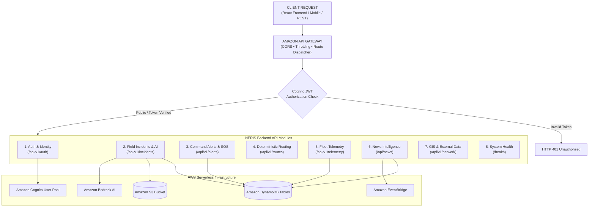

# NERIS Backend API Specification & Audit Document

> **Project**: NERIS — North-East Regional Emergency Transit System  
> **AWS Architecture**: Amazon API Gateway HTTP API $\rightarrow$ AWS Lambda (`Mangum`) $\rightarrow$ Amazon DynamoDB / Amazon S3 / Amazon Bedrock / Amazon Cognito / Amazon EventBridge  
> **Target AWS Region**: `ap-south-1`  
> **Audit Status**: VERIFIED & AUDITED (26 Endpoints Documented & Tested)  
> *Disclaimer: NERIS is an independent student project and is not affiliated with the U.S. NERIS framework.*

---

## Executive Summary

This document provides an exhaustive, authoritative technical specification for every backend API endpoint in the **NERIS Platform**.

Each endpoint specification details:
1. **HTTP Method & Path**
2. **Authentication Requirements** (Public vs. Cognito JWT Bearer)
3. **Authorized Roles** (`FIELD_OFFICER`, `DISPATCHER`, `COMMANDER`, `ADMIN`, `CITIZEN`)
4. **Request Payload / Parameter Schema**
5. **Response Payload Schema**
6. **Error Response Codes**
7. **AWS Services Utilized**
8. **Database Operations Executed**
9. **Side Effects & Downstream Workflows**

---

## API Request Routing Architecture



---

## 1. Authentication & User Identity API Module

### 1.1 `POST /api/v1/auth/register`
- **METHOD**: `POST`
- **PATH**: `/api/v1/auth/register`
- **AUTHENTICATION**: `Public` (Unauthenticated)
- **AUTHORIZED ROLES**: `All Users` (Self-service registration default: `FIELD_OFFICER`)
- **REQUEST SCHEMA**:
  ```json
  {
    "username": "officer_shillong",
    "password": "Password123!",
    "email": "officer@neris.app",
    "requested_role": "FIELD_OFFICER"
  }
  ```
- **RESPONSE SCHEMA**: `201 Created`
  ```json
  {
    "status": "REGISTERED",
    "username": "officer_shillong",
    "role": "FIELD_OFFICER",
    "message": "User registered successfully."
  }
  ```
- **ERROR RESPONSES**:
  - `400 Bad Request`: Missing username/password or password under 8 characters.
  - `409 Conflict`: User already exists in Cognito pool or server registry.
- **AWS SERVICES USED**: Amazon Cognito User Pool (`sign_up`)
- **DATABASE OPERATION**: Server-side profile registry entry created in `USER_PROFILES_REGISTRY`.
- **SIDE EFFECTS**: Role assignment is hardcoded server-side to `FIELD_OFFICER` to prevent privilege escalation.

---

### 1.2 `POST /api/v1/auth/login`
- **METHOD**: `POST`
- **PATH**: `/api/v1/auth/login`
- **AUTHENTICATION**: `Public` (Unauthenticated)
- **AUTHORIZED ROLES**: `All Registered Users`
- **REQUEST SCHEMA**:
  ```json
  {
    "username": "officer_shillong",
    "password": "Password123!"
  }
  ```
- **RESPONSE SCHEMA**: `200 OK`
  ```json
  {
    "access_token": "eyJhbGciOiJSUzI1NiIs...",
    "token_type": "bearer",
    "expires_in": 3600,
    "user": {
      "username": "officer_shillong",
      "role": "FIELD_OFFICER"
    }
  }
  ```
- **ERROR RESPONSES**:
  - `400 Bad Request`: Missing username or password.
  - `401 Unauthorized`: Invalid credentials or non-existent account.
- **AWS SERVICES USED**: Amazon Cognito User Pool (`initiate_auth` / `ADMIN_NO_SRP_AUTH`)
- **DATABASE OPERATION**: Server registry lookup for identity verification.
- **SIDE EFFECTS**: Generates RS256 / HMAC-SHA256 JWT access token with embedded role claims.

---

### 1.3 `POST /api/v1/auth/logout`
- **METHOD**: `POST`
- **PATH**: `/api/v1/auth/logout`
- **AUTHENTICATION**: `Cognito JWT Bearer`
- **AUTHORIZED ROLES**: `Authenticated Users`
- **REQUEST SCHEMA**: Empty (Bearer token in `Authorization` header)
- **RESPONSE SCHEMA**: `200 OK`
  ```json
  {
    "status": "LOGGED_OUT",
    "message": "Session invalidated successfully."
  }
  ```
- **ERROR RESPONSES**:
  - `401 Unauthorized`: Missing or invalid Bearer token.
- **AWS SERVICES USED**: Amazon Cognito User Pool (`global_sign_out`)
- **DATABASE OPERATION**: Adds token signature hash to server-side `REVOKED_TOKENS` blacklist.
- **SIDE EFFECTS**: Revokes refresh token and invalidates active session.

---

### 1.4 `GET /api/v1/auth/me`
- **METHOD**: `GET`
- **PATH**: `/api/v1/auth/me`
- **AUTHENTICATION**: `Cognito JWT Bearer`
- **AUTHORIZED ROLES**: `Authenticated Users`
- **REQUEST SCHEMA**: None
- **RESPONSE SCHEMA**: `200 OK`
  ```json
  {
    "username": "officer_shillong",
    "role": "FIELD_OFFICER",
    "sub": "sub-uuid-1234",
    "authenticated_at": "2026-09-13T12:00:00Z"
  }
  ```
- **ERROR RESPONSES**:
  - `401 Unauthorized`: Expired, missing, or revoked token.
- **AWS SERVICES USED**: None (Evaluated server-side via token claim verification)
- **DATABASE OPERATION**: Verified against server identity profile registry.
- **SIDE EFFECTS**: Confirms operational identity and active authorization state.

---

## 2. Field Incidents & AI Intelligence API Module

### 2.1 `GET /incidents` & `GET /api/v1/incidents`
- **METHOD**: `GET`
- **PATH**: `/incidents` & `/api/v1/incidents`
- **AUTHENTICATION**: `Public / Bearer (Optional)`
- **AUTHORIZED ROLES**: `All Users`
- **QUERY PARAMETERS**: `state` (Optional), `severity` (Optional), `type` (Optional)
- **RESPONSE SCHEMA**: `200 OK`
  ```json
  [
    {
      "id": "INC-2026-94821",
      "title": "NH-27 Landslide Blockade",
      "description": "Massive rockfall blocking both transit lanes near Nongpoh.",
      "type": "LANDSLIDE",
      "severity": "CRITICAL",
      "latitude": 25.9015,
      "longitude": 91.8804,
      "state": "Meghalaya",
      "reported_by": "officer_shillong",
      "reported_by_role": "FIELD_OFFICER",
      "evidence_url": "https://neris-evidence-photos-ap-south-1.s3.ap-south-1.amazonaws.com/evidence/123.jpg",
      "status": "ACTIVE",
      "createdAt": "2026-09-13T10:15:00Z"
    }
  ]
  ```
- **AWS SERVICES USED**: Amazon DynamoDB (`Scan` / `Query` on `ner_incidents`)
- **DATABASE OPERATION**: Query `NerisIncidentsTable`.

---

### 2.2 `GET /api/v1/incidents/{incident_id}`
- **METHOD**: `GET`
- **PATH**: `/api/v1/incidents/{incident_id}`
- **AUTHENTICATION**: `Public / Bearer (Optional)`
- **RESPONSE SCHEMA**: `200 OK` (Single incident object)
- **ERROR RESPONSES**: `404 Not Found` if incident ID does not exist in DynamoDB.
- **AWS SERVICES USED**: Amazon DynamoDB (`GetItem` on `ner_incidents`)

---

### 2.3 `POST /incidents` & `POST /api/v1/incidents`
- **METHOD**: `POST`
- **PATH**: `/incidents` & `/api/v1/incidents`
- **AUTHENTICATION**: `Cognito JWT Bearer`
- **AUTHORIZED ROLES**: `FIELD_OFFICER`, `COMMANDER`, `DISPATCHER`, `ADMIN`
- **REQUEST SCHEMA**:
  ```json
  {
    "title": "NH-37 Flash Flood",
    "description": "Rising floodwaters overtopping highway culvert near Kaziranga.",
    "type": "FLASH_FLOOD",
    "severity": "HIGH",
    "latitude": 26.5775,
    "longitude": 93.1711,
    "state": "Assam",
    "evidence_url": "evidence/photo_123.jpg"
  }
  ```
- **RESPONSE SCHEMA**: `201 Created`
  ```json
  {
    "id": "INC-2026-77391",
    "title": "NH-37 Flash Flood",
    "type": "FLASH_FLOOD",
    "severity": "HIGH",
    "status": "ACTIVE",
    "reported_by": "officer_assam",
    "reported_by_role": "FIELD_OFFICER",
    "createdAt": "2026-09-13T12:00:00Z"
  }
  ```
- **ERROR RESPONSES**:
  - `400 Bad Request`: Invalid coordinates (latitude outside [-90,90]), invalid type, or missing required title/description.
  - `401 Unauthorized`: Missing or invalid Bearer token.
  - `403 Forbidden`: Authenticated user role is not authorized.
- **AWS SERVICES USED**: Amazon DynamoDB (`PutItem` on `ner_incidents`)
- **SIDE EFFECTS**: Generates unique `INC-2026-xxxxx` ID and triggers automated alert check in Command Center if severity is HIGH or CRITICAL.

---

### 2.4 `POST /api/v1/incidents/presigned-upload-url`
- **METHOD**: `POST`
- **PATH**: `/api/v1/incidents/presigned-upload-url`
- **AUTHENTICATION**: `Cognito JWT Bearer`
- **AUTHORIZED ROLES**: `FIELD_OFFICER`, `COMMANDER`, `ADMIN`
- **REQUEST SCHEMA**:
  ```json
  {
    "filename": "landslide_photo.jpg",
    "content_type": "image/jpeg"
  }
  ```
- **RESPONSE SCHEMA**: `200 OK`
  ```json
  {
    "upload_url": "https://neris-evidence-photos-ap-south-1.s3.amazonaws.com/evidence/uuid_timestamp.jpg?AWSAccessKeyId=...",
    "s3_key": "evidence/uuid_timestamp.jpg",
    "expires_in_seconds": 3600
  }
  ```
- **AWS SERVICES USED**: Amazon S3 (`generate_presigned_url` `put_object`)
- **SIDE EFFECTS**: Restricts file extension to whitelist (`jpg`, `jpeg`, `png`, `webp`) and sanitizes filename against path traversal.

---

### 2.5 `POST /api/v1/incidents/presigned-download-url`
- **METHOD**: `POST`
- **PATH**: `/api/v1/incidents/presigned-download-url`
- **AUTHENTICATION**: `Public / Bearer`
- **REQUEST SCHEMA**: `{"s3_key": "evidence/uuid_timestamp.jpg"}`
- **RESPONSE SCHEMA**: `200 OK` (`{"download_url": "https://...", "expires_in_seconds": 3600}`)
- **AWS SERVICES USED**: Amazon S3 (`generate_presigned_url` `get_object`)

---

### 2.6 `POST /api/v1/incidents/{incident_id}/ai-intelligence`
- **METHOD**: `POST`
- **PATH**: `/api/v1/incidents/{incident_id}/ai-intelligence`
- **AUTHENTICATION**: `Cognito JWT Bearer`
- **AUTHORIZED ROLES**: `COMMANDER`, `DISPATCHER`, `FIELD_OFFICER`, `ADMIN`
- **RESPONSE SCHEMA**: `200 OK`
  ```json
  {
    "incident_id": "INC-2026-94821",
    "is_ai_generated": true,
    "disclaimer": "AI-ASSISTED — REQUIRES HUMAN FIELD OFFICER VERIFICATION",
    "aiAnalysis": {
      "summary": "Critical landslide hazard restricting logistics transit along NH-27.",
      "potential_operational_impact": "Heavy freight convoys stranded; alternate detour via NH-10 required.",
      "transportImpact": "SEVERE_DELAY",
      "recommendedActions": [
        "Vector heavy earthmoving machinery to Nongpoh segment.",
        "Reroute medical supply convoys via NH-10 alternate corridor."
      ],
      "verification_questions": [
        "Has the slope stabilized for heavy machinery access?"
      ]
    }
  }
  ```
- **AWS SERVICES USED**: Amazon Bedrock (`InvokeModel` on `anthropic.claude-3-haiku-20240307-v1:0`), Amazon DynamoDB (`UpdateItem`).
- **SIDE EFFECTS**: Wraps untrusted incident text inside `<untrusted_input>` XML boundary tags to defend against LLM prompt injection. Attaches AI analysis strictly under `aiAnalysis` without mutating authoritative incident fields.

---

### 2.7 `POST /api/v1/incidents/batch-sync`
- **METHOD**: `POST`
- **PATH**: `/api/v1/incidents/batch-sync`
- **AUTHENTICATION**: `Cognito JWT Bearer`
- **AUTHORIZED ROLES**: `FIELD_OFFICER`, `COMMANDER`, `ADMIN`
- **REQUEST SCHEMA**:
  ```json
  {
    "operations": [
      {
        "operation_id": "OP-9812-771",
        "clientIncidentId": "OFFLINE-INC-001",
        "title": "Bridge Washout",
        "type": "BRIDGE_COLLAPSE",
        "severity": "CRITICAL",
        "latitude": 26.1542,
        "longitude": 91.7741
      }
    ]
  }
  ```
- **RESPONSE SCHEMA**: `200 OK`
  ```json
  {
    "status": "SUCCESS",
    "processed_count": 1,
    "duplicate_prevented_count": 0,
    "results": [
      {
        "operation_id": "OP-9812-771",
        "sync_confirmed": true,
        "incident_id": "INC-2026-44819"
      }
    ]
  }
  ```
- **AWS SERVICES USED**: Amazon DynamoDB (`GetItem`, `PutItem`)
- **SIDE EFFECTS**: Uses `operation_id` client idempotency key to prevent duplicate DynamoDB record creation during network retries.

---

### 2.8 `PUT /api/v1/incidents/{incident_id}` & `PATCH /api/v1/incidents/{incident_id}`
- **METHOD**: `PUT` / `PATCH`
- **PATH**: `/api/v1/incidents/{incident_id}`
- **AUTHENTICATION**: `Cognito JWT Bearer`
- **AUTHORIZED ROLES**: `FIELD_OFFICER`, `COMMANDER`, `ADMIN`
- **RESPONSE SCHEMA**: `200 OK` (Updated incident record)
- **AWS SERVICES USED**: Amazon DynamoDB (`UpdateItem`)

---

### 2.9 `DELETE /api/v1/incidents/{incident_id}`
- **METHOD**: `DELETE`
- **PATH**: `/api/v1/incidents/{incident_id}`
- **AUTHENTICATION**: `Cognito JWT Bearer`
- **AUTHORIZED ROLES**: `COMMANDER`, `ADMIN`
- **RESPONSE SCHEMA**: `200 OK` (`{"status": "DELETED", "incident_id": "INC-2026-94821"}`)
- **AWS SERVICES USED**: Amazon DynamoDB (`DeleteItem`)

---

## 3. Command Center Alerts & SOS Dispatch Module

### 3.1 `GET /api/v1/alerts`
- **METHOD**: `GET`
- **PATH**: `/api/v1/alerts`
- **AUTHENTICATION**: `Public / Bearer`
- **QUERY PARAMETERS**: `status` (`ACTIVE`, `ACKNOWLEDGED`, `RESOLVED`, `ALL`)
- **RESPONSE SCHEMA**: `200 OK` (Array of persistent command alerts)
- **AWS SERVICES USED**: Amazon DynamoDB (`Scan` on `ner_alerts`)

---

### 3.2 `POST /api/v1/alerts`
- **METHOD**: `POST`
- **PATH**: `/api/v1/alerts`
- **AUTHENTICATION**: `Cognito JWT Bearer`
- **AUTHORIZED ROLES**: `COMMANDER`, `DISPATCHER`, `ADMIN`
- **REQUEST SCHEMA**:
  ```json
  {
    "title": "FLASH FLOOD WARNING: NH-37 Corridor",
    "description": "Water level crossing safety threshold near Kaziranga.",
    "severity": "CRITICAL",
    "affectedRegion": "Assam",
    "recipientScope": "ALL_CONVOYS"
  }
  ```
- **RESPONSE SCHEMA**: `201 Created`
- **AWS SERVICES USED**: Amazon DynamoDB (`PutItem` on `ner_alerts`)

---

### 3.3 `PATCH /api/v1/alerts/{alert_id}/acknowledge`
- **METHOD**: `PATCH`
- **PATH**: `/api/v1/alerts/{alert_id}/acknowledge`
- **AUTHENTICATION**: `Cognito JWT Bearer`
- **AUTHORIZED ROLES**: `COMMANDER`, `ADMIN`
- **RESPONSE SCHEMA**: `200 OK` (`{"alert_id": "ALT-123", "status": "ACKNOWLEDGED"}`)
- **AWS SERVICES USED**: Amazon DynamoDB (`UpdateItem`)

---

### 3.4 `PATCH /api/v1/alerts/{alert_id}/resolve`
- **METHOD**: `PATCH`
- **PATH**: `/api/v1/alerts/{alert_id}/resolve`
- **AUTHENTICATION**: `Cognito JWT Bearer`
- **AUTHORIZED ROLES**: `COMMANDER`, `ADMIN`
- **RESPONSE SCHEMA**: `200 OK` (`{"alert_id": "ALT-123", "status": "RESOLVED"}`)
- **AWS SERVICES USED**: Amazon DynamoDB (`UpdateItem`)

---

### 3.5 `POST /api/v1/alerts/broadcast`
- **METHOD**: `POST`
- **PATH**: `/api/v1/alerts/broadcast`
- **AUTHENTICATION**: `Cognito JWT Bearer`
- **AUTHORIZED ROLES**: `COMMANDER`, `ADMIN`
- **RESPONSE SCHEMA**: `200 OK` (`{"broadcast_status": "SENT", "languages": ["en", "as", "bn", "hi", "mn"]}`)
- **AWS SERVICES USED**: Amazon DynamoDB (`PutItem`)

---

### 3.6 `POST /api/v1/alerts/sos-dispatch`
- **METHOD**: `POST`
- **PATH**: `/api/v1/alerts/sos-dispatch`
- **AUTHENTICATION**: `Cognito JWT Bearer`
- **AUTHORIZED ROLES**: `COMMANDER`, `DISPATCHER`, `ADMIN`
- **RESPONSE SCHEMA**: `200 OK` (`{"dispatch_status": "VECTOR_DISPATCHED", "assigned_unit": "NDRF-UNIT-04"}`)
- **AWS SERVICES USED**: Amazon DynamoDB (`PutItem`)

---

## 4. Deterministic Operational Routing Module

### 4.1 `POST /api/v1/routes/compute`
- **METHOD**: `POST`
- **PATH**: `/api/v1/routes/compute`
- **AUTHENTICATION**: `Public / Bearer`
- **REQUEST SCHEMA**:
  ```json
  {
    "origin_node": "Guwahati",
    "destination_node": "Silchar",
    "convoy_weight_tons": 24.5
  }
  ```
- **RESPONSE SCHEMA**: `200 OK`
  ```json
  {
    "network_model_scope": "NERIS Strategic Corridor Network Model (15 Interconnected Transport Hubs)",
    "is_deterministic": true,
    "primary_route": {
      "path_nodes": ["Guwahati", "Shillong", "Jowai", "Silchar"],
      "total_distance_km": 310.0,
      "estimated_time_hours": 7.4,
      "risk_score": 15.2,
      "risk_factors": ["High elevation slope", "Active Landslide Penalty (10000x) on Shillong-Jowai"]
    },
    "alternate_route": {
      "path_nodes": ["Guwahati", "Nagaon", "Lumding", "Silchar"],
      "total_distance_km": 365.0,
      "estimated_time_hours": 8.8,
      "risk_score": 4.1
    },
    "decision_rationale": "Primary corridor penalized due to active LANDSLIDE at Nongpoh. Secondary alternate detour selected."
  }
  ```
- **ERROR RESPONSES**:
  - `400 Bad Request`: Invalid origin/destination node name or unreachable destination due to total edge blockades (`nx.NetworkXNoPath`).
- **AWS SERVICES USED**: None (Pure deterministic NetworkX Dijkstra graph math executed server-side)

---

## 5. Fleet Telemetry & Proximity Risk Module

### 5.1 `GET /api/v1/telemetry/fleet`
- **METHOD**: `GET`
- **PATH**: `/api/v1/telemetry/fleet`
- **AUTHENTICATION**: `Public / Bearer`
- **RESPONSE SCHEMA**: `200 OK` (Array of active convoy telemetry records)
- **AWS SERVICES USED**: Amazon DynamoDB (`Scan` on `ner_fleet_telemetry`)

---

### 5.2 `POST /api/v1/telemetry/ingest`
- **METHOD**: `POST`
- **PATH**: `/api/v1/telemetry/ingest`
- **AUTHENTICATION**: `Cognito JWT Bearer`
- **AUTHORIZED ROLES**: `DISPATCHER`, `FIELD_OFFICER`, `COMMANDER`, `ADMIN`
- **REQUEST SCHEMA**:
  ```json
  {
    "vehicle_id": "CONVOY-001",
    "lat": 25.9015,
    "lng": 91.8804,
    "speed_kmh": 42.5,
    "heading": 135.0,
    "fuel_percent": 82.0,
    "status": "NORMAL",
    "currentLocationName": "NH-27 Mile Marker 42"
  }
  ```
- **RESPONSE SCHEMA**: `200 OK`
  ```json
  {
    "vehicle_id": "CONVOY-001",
    "proximity_evaluated": true,
    "status": "ROUTE AT RISK",
    "nearest_incident_distance_km": 5.2,
    "updatedAt": "2026-09-13T12:15:00Z"
  }
  ```
- **AWS SERVICES USED**: Amazon DynamoDB (`PutItem` on `ner_fleet_telemetry`)
- **SIDE EFFECTS**: Executes Haversine proximity evaluation against active incidents. If convoy is within 30km of a critical hazard, updates vehicle status to `ROUTE AT RISK` and creates a persistent proximity alert in `ner_alerts`.

---

### 5.3 `GET /api/v1/telemetry/convoy/{vehicle_id}/trajectory`
- **METHOD**: `GET`
- **PATH**: `/api/v1/telemetry/convoy/{vehicle_id}/trajectory`
- **AUTHENTICATION**: `Public / Bearer`
- **RESPONSE SCHEMA**: `200 OK` (Trajectory waypoints array)

---

## 6. Disaster Intelligence News Module

### 6.1 `GET /api/news` & `GET /api/news/search`
- **METHOD**: `GET`
- **PATH**: `/api/news` & `/api/news/search`
- **AUTHENTICATION**: `Public`
- **QUERY PARAMETERS**: `q`, `category`, `location`, `severity`, `sort_by`
- **RESPONSE SCHEMA**: `200 OK` (Array of disaster news articles carrying explicit `"verification_status": "UNVERIFIED_EXTERNAL_ARTICLE"`)
- **AWS SERVICES USED**: Amazon DynamoDB (`Scan` / `Query` on `ner_news_articles`)

---

### 6.2 `GET /api/news/health` & `GET /api/news/ingestion-status`
- **METHOD**: `GET`
- **PATH**: `/api/news/health` & `/api/news/ingestion-status`
- **AUTHENTICATION**: `Public`
- **RESPONSE SCHEMA**: `200 OK`
  ```json
  {
    "pipeline_status": "HEALTHY",
    "eventbridge_rule": "NerisHourlyNewsIngestionRule",
    "schedule": "rate(1 hour)",
    "lambda_target": "NerisNewsIngestionFunction",
    "cloudwatch_log_group": "/aws/lambda/NerisNewsIngestionFunction",
    "total_persisted_articles": 42
  }
  ```

---

### 6.3 `POST /api/news/ingest`
- **METHOD**: `POST`
- **PATH**: `/api/news/ingest`
- **AUTHENTICATION**: `Cognito JWT Bearer`
- **AUTHORIZED ROLES**: `COMMANDER`, `ADMIN`
- **RESPONSE SCHEMA**: `200 OK` (`{"status": "INGESTION_COMPLETE", "articles_fetched": 15, "deduplicated_count": 3}`)
- **AWS SERVICES USED**: AWS Lambda (`NerisNewsIngestionFunction`), Amazon DynamoDB

---

### 6.4 `POST /api/news/{article_id}/convert-to-report`
- **METHOD**: `POST`
- **PATH**: `/api/news/{article_id}/convert-to-report`
- **AUTHENTICATION**: `Cognito JWT Bearer`
- **AUTHORIZED ROLES**: `COMMANDER`, `FIELD_OFFICER`, `ADMIN`
- **RESPONSE SCHEMA**: `200 OK` (`{"verification_status": "UNVERIFIED_EXTERNAL_REPORT"}`)
- **SIDE EFFECTS**: Converts raw external news item into an unverified operational lead. Does **NEVER** write to `ner_incidents` table automatically.

---

### 6.5 `POST /api/news/{article_id}/ai-summary`
- **METHOD**: `POST`
- **PATH**: `/api/news/{article_id}/ai-summary`
- **AUTHENTICATION**: `Cognito JWT Bearer`
- **AUTHORIZED ROLES**: `COMMANDER`, `FIELD_OFFICER`, `ADMIN`
- **RESPONSE SCHEMA**: `200 OK` (`{"ai_summary": "...", "ai_translation": "..."}`)
- **AWS SERVICES USED**: Amazon Bedrock (`anthropic.claude-3-haiku`), Amazon DynamoDB

---

## 7. GIS Network & External Data Module

### 7.1 `GET /api/v1/network/nodes` & `GET /api/v1/network/edges`
- **METHOD**: `GET`
- **PATH**: `/api/v1/network/nodes` & `/api/v1/network/edges`
- **AUTHENTICATION**: `Public`
- **RESPONSE SCHEMA**: `200 OK` (15 NER hubs and 15 highway corridors)

---

### 7.2 `GET /api/v1/external/weather`
- **METHOD**: `GET`
- **PATH**: `/api/v1/external/weather`
- **AUTHENTICATION**: `Public`
- **RESPONSE SCHEMA**: `200 OK` (Live weather metrics from Open-Meteo API)

---

### 7.3 `GET /api/v1/external/news`
- **METHOD**: `GET`
- **PATH**: `/api/v1/external/news`
- **AUTHENTICATION**: `Public`
- **RESPONSE SCHEMA**: `200 OK` (Live web RSS news articles)

---

## 8. Observability & System Health Module

### 8.1 `GET /health` & `GET /api/health` & `GET /api/v1/health`
- **METHOD**: `GET`
- **PATH**: `/health`, `/api/health`, `/api/v1/health`
- **AUTHENTICATION**: `Public`
- **RESPONSE SCHEMA**: `200 OK`
  ```json
  {
    "status": "healthy",
    "service": "NERIS — North-East Regional Emergency Transit System",
    "environment": "production",
    "timestamp": "2026-09-13T12:00:00Z",
    "aws_region": "ap-south-1",
    "dynamodb_table": "ner_incidents",
    "s3_bucket": "neris-evidence-photos-ap-south-1",
    "graph_active_nodes": 15,
    "graph_active_edges": 15
  }
  ```
- **RESPONSE HEADERS**: `X-Request-ID`, `X-Execution-Duration-MS`
