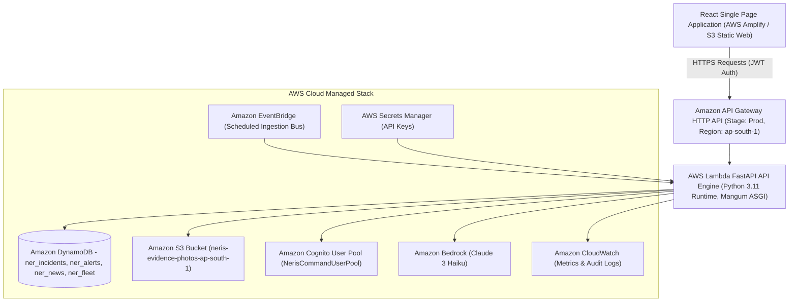

# AWS System Architecture — NERIS — North-East Regional Emergency Transit System

**Project Name**: NERIS — North-East Regional Emergency Transit System  
**Target AWS Region**: `ap-south-1` (Asia Pacific - Mumbai)  
**AWS First Commit Track**: **Ship It Track**  
*Disclaimer: NERIS is an independent student project and is not affiliated with the U.S. NERIS framework.*


---

## 1. System Architecture Diagram



---

## 2. Serverless Component Specification (`template.yaml`)

### 2.1 AWS Lambda Compute Engine
* **Resource Identifier**: `NerisApiFunction`
* **Runtime**: `python3.11`
* **Handler**: `app.main.handler` (`Mangum` ASGI wrapper over FastAPI application)
* **Memory & Timeout**: 512 MB memory, 30-second execution timeout.
* **Environment Variables**:
  * `AWS_REGION_NAME`: `ap-south-1`
  * `DYNAMODB_INCIDENTS_TABLE`: `ner_incidents`
  * `S3_BUCKET_EVIDENCE`: `neris-evidence-photos-ap-south-1`
  * `COGNITO_USER_POOL_ID`: `NerisCommandUserPool`
  * `COGNITO_CLIENT_ID`: `NerisUserPoolClient`

---

### 2.2 Amazon API Gateway HTTP API
* **Resource Identifier**: `NerisApi`
* **Type**: AWS Serverless HTTP API Gateway
* **Stage Name**: `Prod`
* **CORS Policy**: Configured in `template.yaml` to restrict allowed methods (`GET, POST, PUT, PATCH, DELETE, OPTIONS`) and allow origin domain (`http://localhost:5173`).

---

### 2.3 Amazon DynamoDB NoSQL Storage
All tables are provisioned with `PAY_PER_REQUEST` billing mode and server-side encryption.

1. **`ner_incidents` Table**: Stores field incident reports, coordinates, severity levels, verification statuses, and Bedrock AI assessment payloads. `PointInTimeRecoveryEnabled: true`.
2. **`ner_alerts` Table**: Stores operational command alerts, proximity hazard warnings, recipient scopes, and commander acknowledgment timestamps.
3. **`ner_news_articles` Table**: Stores ingested regional disaster news leads, SHA256 hashes for deduplication, locations, and multi-language translations.
4. **`ner_fleet_telemetry` Table**: Stores supply convoy GPS positions, speed, heading, cargo type, and proximity hazard flags.

---

### 2.4 Amazon S3 Field Evidence Store
* **Bucket Name**: `neris-evidence-photos-ap-south-1`
* **Security Controls**:
  * `PublicAccessBlockConfiguration`: `BlockPublicAcls`, `BlockPublicPolicy`, `IgnorePublicAcls`, `RestrictPublicBuckets` set to `true`.
  * `BucketEncryption`: Enforces `AES256` server-side encryption by default on all uploaded media objects.
  * `CorsConfiguration`: Restricts upload methods (`GET, PUT, POST, HEAD`) and allowed headers.

---

### 2.5 Amazon Cognito Authentication
* **User Pool**: `NerisCommandUserPool`
* **App Client**: `NerisWebClient`
* **Auth Flows**: `ALLOW_USER_PASSWORD_AUTH` and `ALLOW_REFRESH_TOKEN_AUTH`.
* **Password Policy**: Minimum 8 characters, requiring uppercase, lowercase, and numeric characters.
* **JWT Token Security**: Access and ID tokens carry user claims (`sub`, `email`, `custom:role`) signed via RSA-256 keys.

---

### 2.6 Amazon Bedrock Intelligence Integration
* **Model ID**: `anthropic.claude-3-haiku-20240307-v1:0`
* **API Invocation**: Called via `boto3.client('bedrock-runtime')` inside `aws_bedrock.py`.
* **Structured Output Schema**: Enforces JSON validation for incident summary, risk factors, recommended priority, questions for human verification, and suggested actions.

---

### 2.7 Amazon CloudWatch & Observability
* **Log Group**: `/aws/lambda/neris-api-function`
* **Structured Logging**: Captures request timing, HTTP status codes, operation IDs, and exception tracebacks while redacting authorization headers and refresh tokens.

---

## 3. IAM Least-Privilege Statement

The Lambda execution role in `template.yaml` defines explicitly bounded permissions:

```yaml
Policies:
  - DynamoDBCrudPolicy:
      TableName: !Ref NerisIncidentsTable
  - DynamoDBCrudPolicy:
      TableName: !Ref NerisAlertsTable
  - DynamoDBCrudPolicy:
      TableName: !Ref NerisNewsArticlesTable
  - DynamoDBCrudPolicy:
      TableName: !Ref NerisFleetTable
  - S3CrudPolicy:
      BucketName: !Ref NerisEvidenceBucket
  - Statement:
      - Effect: Allow
        Action:
          - bedrock:InvokeModel
        Resource: "*"
      - Effect: Allow
        Action:
          - secretsmanager:GetSecretValue
        Resource: "*"
```
