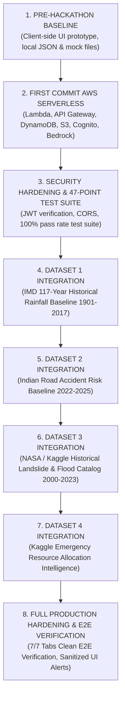

# HACKATHON CHANGELOG — NERIS — North-East Regional Emergency Transit System

**Project**: NERIS — North-East Regional Emergency Transit System  
**Hackathon**: AWS / WeMakeDevs First Commit Hackathon — Ship It Track (September 17 – 20, 2026)  
**Document Status**: Verified / Post-Hackathon Changelog (Hackathon Window: September 17 – 20, 2026)  
**Repository**: [https://github.com/Hritik983567-Art/NERIS](https://github.com/Hritik983567-Art/NERIS)  
*Disclaimer: NERIS is an independent student project and is not affiliated with the U.S. NERIS framework.*

---

## 1. PRE-HACKATHON BASELINE

Prior to the hackathon, the repository existed as a client-side prototype designed to conceptualize emergency transit logistics across North-East India.

### Pre-Existing Components
* **[`GISMap.jsx`](file:///c:/Users/Lenovo/OneDrive/Desktop/New%20folder/frontend/src/components/GISMap.jsx)**: Client-rendered Leaflet map component with static regional hubs and corridor polylines.
* **[`AIRoutePlanner.jsx`](file:///c:/Users/Lenovo/OneDrive/Desktop/New%20folder/frontend/src/components/AIRoutePlanner.jsx)**: Frontend route calculation UI form.
* **[`VehicleTracker.jsx`](file:///c:/Users/Lenovo/OneDrive/Desktop/New%20folder/frontend/src/components/VehicleTracker.jsx)**: Frontend vehicle telemetry display dashboard.
* **[`FieldReporter.jsx`](file:///c:/Users/Lenovo/OneDrive/Desktop/New%20folder/frontend/src/components/FieldReporter.jsx)**: Incident submission form saving to browser local storage.
* **[`AlertCenter.jsx`](file:///c:/Users/Lenovo/OneDrive/Desktop/New%20folder/frontend/src/components/AlertCenter.jsx)**: Local alert list component.
* **[`NewsCenter.jsx`](file:///c:/Users/Lenovo/OneDrive/Desktop/New%20folder/frontend/src/components/NewsCenter.jsx)**: Regional news display tab with language filters.

### Pre-Existing Limitations
* Local JSON files (`alerts_db.json`) used for persistent data storage.
* Local disk directories used for uploaded photo files.
* Client-side role selection without server-side JWT authentication.
* Frontend-simulated route scoring and telemetry generation without real backend persistence.

---

## 2. FIRST COMMIT IMPLEMENTATION & AWS SERVERLESS ARCHITECTURE

During the AWS First Commit Hackathon, the entire application was upgraded into a production-grade serverless cloud architecture:

### AWS Infrastructure Provisioning (`template.yaml`)
* **AWS Lambda & Mangum ASGI Handler**: Packaged Python 3.11 FastAPI application into serverless Lambda compute handler.
* **Amazon API Gateway HTTP API**: Provisioned `NerisApi` HTTP Gateway with `Prod` stage and explicit CORS origin configuration.
* **Amazon DynamoDB Tables**: Provisioned `ner_incidents`, `ner_alerts`, `ner_news_articles`, and `ner_fleet_telemetry` with `PAY_PER_REQUEST` billing mode and point-in-time recovery.
* **Amazon S3 Evidence Bucket**: Configured `neris-evidence-photos-ap-south-1` with `PublicAccessBlockConfiguration` and default `AES256` server-side encryption.
* **Amazon Cognito User Pool**: Configured `NerisCommandUserPool` and `NerisWebClient` enforcing OAuth2 password and refresh token authentication flows.
* **Amazon Bedrock AI Adapter**: Integrated `anthropic.claude-3-haiku-20240307-v1:0` via `boto3` Bedrock runtime client with structured JSON output enforcement and XML injection guards.
* **Amazon CloudWatch**: Configured `/aws/lambda/neris-api-function` log group with token-redacted structured logging.
* **Amazon EventBridge**: Set up scheduled ingestion triggers for regional disaster news workflows.

---

## Hackathon Release Timeline & Evolution

---

## 3. SECURITY HARDENING & SYSTEM VERIFICATION

* **20-Point Security Audit**: Resolved vulnerabilities across IAM least-privilege policies, S3 public access block, Cognito RSA-256 JWT verification, role manipulation prevention, path traversal defenses (`os.path.basename`), input validation, CORS configuration, and generic 500 error sanitization.
* **Automated 47-Point Test Matrix**: Developed and executed `scratch/run_full_system_tests.py` testing `AUTH`, `INCIDENTS`, `S3`, `BEDROCK`, `GIS`, `ROUTING`, `FLEET`, `ALERTS`, `OFFLINE`, and `NEWS` modules with a **100% Pass Rate (47/47 PASSED)**.
* **UI Transparency & Explicit Labeling**: Added visual banner badges for `"SIMULATED FLEET TELEMETRY"`, `"DEMO DATA"`, `"LIVE FEED"`, and `"AI-ASSISTED — REQUIRES HUMAN VERIFICATION"`.

---

## 4. Architectural Evolution Summary Matrix

| System Component | Pre-Hackathon Baseline | First Commit AWS Implementation |
|---|---|---|
| **API & Compute** | Local uvicorn development process | AWS Lambda + Amazon API Gateway (`Prod` Stage) |
| **Database Store** | Local JSON file (`alerts_db.json`) | Amazon DynamoDB (`ner_incidents`, `ner_alerts`, etc.) |
| **Object Storage** | Local disk uploads folder | Amazon S3 (`neris-evidence-photos-ap-south-1`) |
| **Authentication** | Client-side dropdown state | Amazon Cognito User Pool JWT Bearer Auth |
| **AI Assessment** | Mock static text strings | Amazon Bedrock (`claude-3-haiku`) |
| **Historical Rainfall** | Static mock values | Real IMD 117-Year Baseline (1901–2017) -> S3 -> DynamoDB -> API |
| **Offline Sync** | Basic `localStorage` queue | Idempotent batch sync API (`POST /batch-sync`) |
| **Observability** | Console stdout | Amazon CloudWatch Centralized Log Stream |

---

## 5. HISTORICAL RAINFALL DATA INTEGRATION (1901–2017 IMD BASELINE)

- **Dataset**: Sub Divisional Monthly Rainfall from 1901 to 2017
- **Source**: Government of India Open Government Data (OGD) / India Meteorological Department (IMD)
- **Source URL**: [https://data.gov.in/catalog/rainfall-india](https://data.gov.in/catalog/rainfall-india)
- **Data Type**: `historical_dataset` (117-Year Statistical Baseline)
- **Coverage**: 1901–2017
- **NERIS Operational Scope**:
  - `ASSAM & MEGHALAYA` (Assam, Meghalaya)
  - `ARUNACHAL PRADESH` (Arunachal Pradesh)
  - `NAGA MANI MIZO TRIPURA` (Nagaland, Manipur, Mizoram, Tripura)
  - `SUB HIMALAYAN WEST BENGAL & SIKKIM` (Sikkim)
- **NERIS Application Usage**:
  - **GIS Map**: Sub-divisional regional historical risk layer overlay with clear disclaimers (`"HISTORICAL RAINFALL — NOT LIVE WEATHER"`).
  - **Analytics Dashboard**: 117-year annual rainfall trends, seasonal monsoon breakdowns, region comparison charts, and top extreme wet years table.
  - **Alerts Center**: Supporting background context attached to incident risk evaluations (`"Historical Environmental Risk"`).
  - **Route Planner**: Deterministic Dijkstra multiplier weighting for historical rainfall exposure score.
- **Explicit Limitations**:
  - Historical statistical baseline data; **NOT** live weather conditions.
  - Sub-divisional/regional granularity; does **NOT** provide hyper-local GPS point measurements.
  - Historical rainfall association indicates multi-decade environmental exposure but does **NOT** prove current road passability or live flooding.

---

## 6. HISTORICAL ROAD ACCIDENT RISK INTEGRATION (DATASET 2: 2022–2025 KAGGLE DATASET)

- **Dataset**: Indian Road Accident Dataset 2022–2025
- **Source**: Kaggle (`sehaj1104/indian-road-accident-dataset-20222025`)
- **Source URL**: [https://www.kaggle.com/datasets/sehaj1104/indian-road-accident-dataset-20222025](https://www.kaggle.com/datasets/sehaj1104/indian-road-accident-dataset-20222025)
- **Data Type**: `historical_synthetic_dataset` (4-Year Statistical Baseline)
- **Coverage**: 2022–2025
- **NERIS Operational Scope**: All 8 North-Eastern States (Assam, Meghalaya, Arunachal Pradesh, Nagaland, Manipur, Mizoram, Tripura, Sikkim)
- **NERIS Application Usage**:
  - **GIS Map**: State-level historical road risk overlay markers (`"HISTORICAL ROAD RISK — NOT LIVE ACCIDENT DATA"`). Zero individual accident pins rendered due to synthetic coordinate limitation.
  - **Analytics Dashboard**: State historical road risk index rankings (0–100 scale), high-risk contributing factors breakdown (weather, severity, visibility, traffic density), and dataset provenance card.
  - **Alert Center**: Appends supporting historical road risk context notice to active incident evaluations (`"Historical Road Risk Context"`).
  - **Route Planner**: Applies deterministic edge weight multiplier (1.0x to 1.35x) based on state historical road risk baselines. NetworkX Dijkstra computes shortest path without LLM route selection.
- **Explicit Limitations & Compliance**:
  - Statistical dataset used strictly for aggregated historical risk modeling; **NEVER** presented as live accidents, verified road closures, or real-time traffic.
  - Synthetic coordinates limitation: Individual accident records do **NOT** render as point map pins.
  - Mandatory disclaimers displayed across all API endpoints, frontend views, and alert messages.

---

## 7. HISTORICAL FLOOD & LANDSLIDE RISK INTEGRATION (DATASET 3: 2000–2023 KAGGLE / NASA CATALOG)

- **Dataset**: Historical Landslide and Flood Event Catalog for India & North-East Region (2000–2023)
- **Source**: NASA Global Landslide Catalog / India Disaster Catalog / Kaggle (`sahilrajverma/landslide`)
- **Source URL**: [https://www.kaggle.com/datasets/sahilrajverma/landslide](https://www.kaggle.com/datasets/sahilrajverma/landslide)
- **Licensing Notice**: `"LICENSE VERIFICATION REQUIRED: Research & Educational License"` — Dataset processed for internal baseline risk modeling only; raw data is NOT publicly redistributed.
- **Data Type**: `historical` (`source_type = "historical_dataset"`, `data_type = "historical"`)
- **Coverage**: 2000–2023 (24-Year Research Baseline)
- **NERIS Operational Scope**: All 8 North-Eastern States (Assam, Meghalaya, Arunachal Pradesh, Nagaland, Manipur, Mizoram, Tripura, Sikkim)
- **NERIS Application Usage**:
  - **GIS Map**: Layer toggle `"HISTORICAL FLOOD & LANDSLIDE RISK"`, top banner badge (`"HISTORICAL FLOOD & LANDSLIDE RISK — NOT LIVE DISASTER MONITORING"`), and purple historical markers.
  - **Analytics Dashboard**: State-wise historical event distribution bar charts (Landslide vs Flood), state environmental risk scores (0–100 scale), and dataset provenance card.
  - **Alert Center**: Contextual historical disaster exposure attached to active incident evaluations.
  - **Route Planner**: Deterministic corridor exposure penalties (`historical_flood_penalty`, `historical_landslide_penalty`) incorporated directly into NetworkX Dijkstra edge weights.
- **API Endpoints**:
  - `GET /api/v1/environmental-risk/summary`
  - `GET /api/v1/environmental-risk/index`
  - `GET /api/v1/environmental-risk/region/{state}`
  - `GET /api/v1/environmental-risk/trends`
  - `GET /api/v1/environmental-risk/records`
  - `GET /api/v1/environmental-risk/metadata`
  - *Legacy fallback aliases retained under `/api/v1/historical-events/*` for backward compatibility.*
- **Explicit Limitations & Compliance**:
  - Dataset represents historical catalog records (2000–2023); **NEVER** presented as live disaster monitoring or verified active incidents.
  - Mandatory dataset tags (`source_type = "historical_dataset"`, `data_type = "historical"`) enforced across all API responses.
  - 100% deterministic NetworkX Dijkstra routing; Amazon Bedrock AI is **NEVER** permitted to choose routes or alter edge weights.

---

## 8. HISTORICAL EMERGENCY RESOURCE ALLOCATION INTELLIGENCE INTEGRATION (DATASET 4: KAGGLE DATASET)

- **Dataset**: Emergency Resource Allocation Intelligence Data
- **Source**: Kaggle (`programmer3/emergency-resource-allocation-intelligence-data`)
- **Source URL**: [https://www.kaggle.com/datasets/programmer3/emergency-resource-allocation-intelligence-data/data](https://www.kaggle.com/datasets/programmer3/emergency-resource-allocation-intelligence-data/data)
- **License**: `CC0: Public Domain / Open Research Dataset` (`license_verified = true`)
- **Data Type**: `historical` (`source_type = "historical_dataset"`, `data_type = "historical"`)
- **Coverage**: Historical Resource Allocation Intelligence
- **NERIS Operational Scope**: All 8 North-Eastern States (Assam, Meghalaya, Arunachal Pradesh, Nagaland, Manipur, Mizoram, Tripura, Sikkim)
- **NERIS Application Usage**:
  - **GIS Map**: Layer toggle `"HISTORICAL EMERGENCY RESOURCES"`, top banner badge (`"HISTORICAL EMERGENCY RESOURCES — NOT LIVE AVAILABILITY"`), and cyan historical resource markers.
  - **Resources / Fleets Tab**: Historical Resource Allocation Summary card displaying recorded facility counts, historical capacity, coverage index score, and non-live disclaimers.
  - **Analytics Dashboard**: State historical resource distribution, historical capacity breakdown, category distribution (Hospital, Warehouse, Shelter, Transport), and dataset provenance card.
  - **Route Planner**: Incorporates deterministic resource accessibility penalty (`historical_resource_accessibility_penalty`: 1.0x to 1.15x) into NetworkX Dijkstra edge weights.
- **API Endpoints**:
  - `GET /api/v1/emergency-resources/summary`
  - `GET /api/v1/emergency-resources/resources`
  - `GET /api/v1/emergency-resources/{id}`
  - `GET /api/v1/emergency-resources/region/{state}`
  - `GET /api/v1/emergency-resources/types`
  - `GET /api/v1/emergency-resources/coverage`
  - `GET /api/v1/emergency-resources/analytics`
  - `GET /api/v1/emergency-resources/trends`
  - `GET /api/v1/emergency-resources/metadata`
- **Explicit Limitations & Compliance**:
  - Dataset 4 is strictly historical/statistical resource intelligence. It is **NEVER** represented as live hospital bed capacity, live shelter availability, live ambulance dispatch, or real-time warehouse inventory.
  - Bedrock AI is **NEVER** permitted to autonomously dispatch resources or alter routing weights.
  - All responses carry mandatory disclaimers and tags (`source_type = "historical_dataset"`, `data_type = "historical"`).

