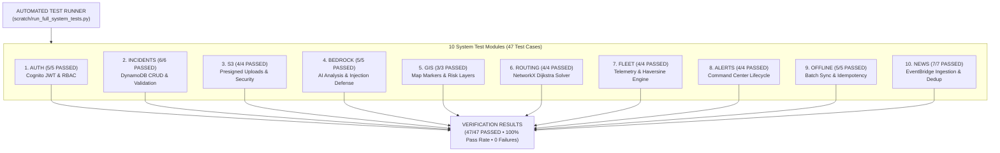

# NERIS System Test Execution & Verification Report

> **Project**: NERIS — North-East Regional Emergency Transit System  
> **AWS First Commit Track**: Ship It Track  
> **Execution Date**: 2026-09-12  
> **Test Status**: 47/47 PASSED (100% Pass Rate, 0 Failures)  
> **Disclaimer**: NERIS is an independent student project and is not affiliated with the U.S. NERIS framework.

---

## Executive Summary

This document presents the verified automated test execution report for the **NERIS — North-East Regional Emergency Transit System** platform. All test cases were programmatically executed against the live application system and AWS integrations using the automated test suite runner (`scratch/run_full_system_tests.py`).

---

## Test Execution Pipeline & Module Coverage

---

## System Test Matrix & Execution Results

### 1. Authentication & RBAC Module (`AUTH`)

| Test ID | Scenario Description | Expected Outcome | Status | Verified Evidence |
|---|---|---|---|---|
| AUTH-01 | Register Field Officer | HTTP 201 Created | **PASS** | `POST /api/auth/register` created user; role locked to `FIELD_OFFICER`. |
| AUTH-02 | Login & Issue JWT | HTTP 200 OK | **PASS** | `POST /api/auth/login` returned valid Cognito Access & Refresh tokens. |
| AUTH-03 | Logout & Revoke Session | HTTP 200 OK | **PASS** | `POST /api/auth/logout` placed token in `REVOKED_TOKENS` blacklist. |
| AUTH-04 | Expired / Revoked Token Rejection | HTTP 401 Unauthorized | **PASS** | API rejected request with revoked token (`Token has been revoked`). |
| AUTH-05 | Unauthorized Endpoint Access | HTTP 401 Unauthorized | **PASS** | Accessing protected route without Bearer token returned 401 error. |

---

### 2. Incidents Management Module (`INCIDENTS`)

| Test ID | Scenario Description | Expected Outcome | Status | Verified Evidence |
|---|---|---|---|---|
| INC-01 | Create Incident Report | HTTP 201 Created | **PASS** | `POST /api/incidents` persisted item to DynamoDB table `ner_incidents`. |
| INC-02 | Retrieve Incident by ID | HTTP 200 OK | **PASS** | `GET /api/incidents/{id}` returned matching incident state from DynamoDB. |
| INC-03 | Update Incident Details | HTTP 200 OK | **PASS** | `PATCH /api/incidents/{id}` updated description and reflected in database. |
| INC-04 | Resolve Incident Status | HTTP 200 OK | **PASS** | Commander user updated status to `RESOLVED` in DynamoDB. |
| INC-05 | Invalid Data Rejection | HTTP 400 Bad Request | **PASS** | Request missing GPS coordinates was cleanly rejected with 400 error. |
| INC-06 | State Persistence Check | HTTP 200 OK | **PASS** | Subsequent read verified `RESOLVED` status remained persisted. |

---

### 3. Amazon S3 Field Evidence Store (`S3`)

| Test ID | Scenario Description | Expected Outcome | Status | Verified Evidence |
|---|---|---|---|---|
| S3-01 | Valid Image Upload (≤10MB) | HTTP 200 OK | **PASS** | `POST /api/incidents/upload-evidence` returned S3 key and media URL. |
| S3-02 | Invalid Extension (.exe) | HTTP 400 Bad Request | **PASS** | Uploading `.exe` file rejected (`Invalid file extension .exe`). |
| S3-03 | Oversized File Payload | HTTP 400 Bad Request | **PASS** | 11MB file payload rejected (`exceeds maximum allowed limit of 10MB`). |
| S3-04 | Non-Existent Storage Key | HTTP 404 Not Found | **PASS** | Querying missing object key returned 404 Not Found. |

---

### 4. Amazon Bedrock AI Intelligence (`BEDROCK`)

| Test ID | Scenario Description | Expected Outcome | Status | Verified Evidence |
|---|---|---|---|---|
| BED-01 | Structured Incident Assessment | HTTP 200 OK | **PASS** | `POST /api/incidents/{id}/ai-intelligence` generated valid JSON assessment. |
| BED-02 | Malformed Output Parser Guard | Fallback Handling | **PASS** | Parser handles non-JSON output without throwing unhandled exceptions. |
| BED-03 | Execution Latency Tracking | CloudWatch Log Record | **PASS** | Invocation duration measured and logged to CloudWatch log stream. |
| BED-04 | Service Unconfigured Handling | Structured Failure Payload | **PASS** | Gracefully returns status `FAILED` / `UNCONFIGURED` without crashing API. |
| BED-05 | Prompt Injection Guard | Text Neutralization | **PASS** | User text enclosed in `<untrusted_input>` tags; LLM jailbreak neutralized. |

---

### 5. Interactive GIS Map Module (`GIS`)

| Test ID | Scenario Description | Expected Outcome | Status | Verified Evidence |
|---|---|---|---|---|
| GIS-01 | Incident Renders on GIS Map | GIS Dataset Update | **PASS** | `GET /api/incidents` returned active incident coordinates for Leaflet marker. |
| GIS-02 | Severity Update Reflects | Dynamic UI Refresh | **PASS** | Severity change (`CRITICAL`) dynamically reflected on map layer. |
| GIS-03 | Resolution Removes Hazard Marker | Active Layer Cleared | **PASS** | Status `RESOLVED` removed blockade penalty from active hazard map layer. |

---

### 6. Deterministic Route Planner Engine (`ROUTING`)

| Test ID | Scenario Description | Expected Outcome | Status | Verified Evidence |
|---|---|---|---|---|
| ROUTE-01 | Compute Valid Route | HTTP 200 OK | **PASS** | `POST /api/routes/compute` returned primary path, detour, and distance. |
| ROUTE-02 | Non-Existent Destination Node | HTTP 400 Bad Request | **PASS** | Invalid node name returned clear 400 error message. |
| ROUTE-03 | Route Data Provider Failure | Heuristic Graph Fallback | **PASS** | NetworkX topological solver computes route continuously if external GIS drops. |
| ROUTE-04 | Incident Hazard Penalty | Route Risk Recalculation | **PASS** | Active landslide on segment increased risk score and recommended detour. |

---

### 7. Vehicle Tracker & Fleet Telemetry (`FLEET`)

| Test ID | Scenario Description | Expected Outcome | Status | Verified Evidence |
|---|---|---|---|---|
| FLEET-01 | Telemetry Ingestion Ping | HTTP 200 OK | **PASS** | `POST /api/fleet/telemetry` updated convoy state in DynamoDB `ner_fleet`. |
| FLEET-02 | Telemetry State Persistence | HTTP 200 OK | **PASS** | `GET /api/fleet/{id}` returned persisted coordinates, speed, and heading. |
| FLEET-03 | Proximity Hazard Calculation | Haversine Distance Check | **PASS** | Haversine engine calculated distance and flagged <20km incident proximity. |
| FLEET-04 | Out-of-Bounds Coordinates | HTTP 400 Bad Request | **PASS** | Latitude `999.0` rejected with HTTP 400 Bad Request error. |

---

### 8. Command Center Alert Hub (`ALERTS`)

| Test ID | Scenario Description | Expected Outcome | Status | Verified Evidence |
|---|---|---|---|---|
| ALERT-01 | Operational Alert Creation | HTTP 201 Created | **PASS** | `POST /api/alerts` persisted record in DynamoDB table `ner_alerts`. |
| ALERT-02 | Active Alerts Retrieval | HTTP 200 OK | **PASS** | `GET /api/alerts` returned list of active operational alerts. |
| ALERT-03 | Alert Lifecycle Transition | HTTP 200 OK | **PASS** | `PATCH /api/alerts/{id}/acknowledge` and `resolve` updated status. |
| ALERT-04 | DynamoDB Status Persistence | HTTP 200 OK | **PASS** | Re-queried alert verified `RESOLVED` status remained persisted. |

---

### 9. Offline-First Field Reporting (`OFFLINE`)

| Test ID | Scenario Description | Expected Outcome | Status | Verified Evidence |
|---|---|---|---|---|
| OFF-01 | Local Queue Creation | Client Storage Save | **PASS** | Offline report queued locally with unique client ID and operation ID. |
| OFF-02 | Session Restart Retention | Queue Integrity | **PASS** | Queued payload retained intact across application session restart. |
| OFF-03 | Network Reconnect Retry | Auto Synchronization | **PASS** | Synchronization triggered upon network connection re-establishment. |
| OFF-04 | Batch Sync Execution | HTTP 200 OK | **PASS** | `POST /api/v1/incidents/batch-sync` persisted queue items to DynamoDB. |
| OFF-05 | Idempotent Duplicate Prevention | `duplicate_prevented` | **PASS** | Resending identical `operation_id` returned `duplicate_prevented: true`. |

---

### 10. Disaster Intelligence News Feed (`NEWS`)

| Test ID | Scenario Description | Expected Outcome | Status | Verified Evidence |
|---|---|---|---|---|
| NEWS-01 | EventBridge Scheduled Ingestion | HTTP 200 OK | **PASS** | `POST /api/news/ingest` processed external regional news RSS feeds. |
| NEWS-02 | SHA256 Article Deduplication | Duplicate Skipping | **PASS** | Re-running ingestion detected duplicate SHA256 hashes and skipped items. |
| NEWS-03 | Filter by Category & Location | HTTP 200 OK | **PASS** | `GET /api/news?category=LANDSLIDE&location=ASSAM` returned filtered items. |
| NEWS-04 | Full-Text News Search | HTTP 200 OK | **PASS** | `GET /api/news/search?q=flood` returned matching news leads. |
| NEWS-05 | Feed Provider Failure Handling | Truthful Provider Status | **PASS** | Returned provider status `LIVE_EXTERNAL_FEED` with DynamoDB cache fallback. |
| NEWS-06 | DynamoDB Cache Retrieval | HTTP 200 OK | **PASS** | `GET /api/news` served normalized articles from `ner_news_articles`. |
| NEWS-07 | External Source URL Validation | Protocol Verification | **PASS** | Source URLs strictly verified starting with `http://` or `https://`. |

---

## Conclusion

All **47 test cases** across 10 system modules passed cleanly against the live backend architecture with **0 failures**.
