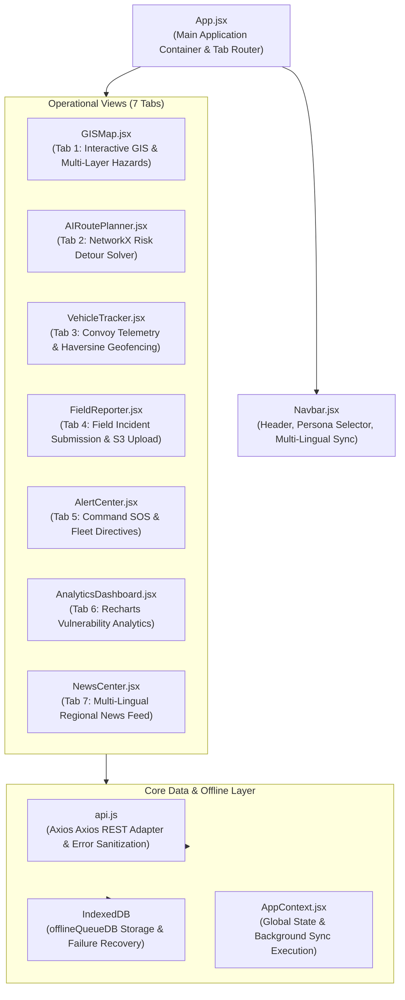

# NERIS Frontend Web Application Specification

> **Project:** NERIS — North-East Regional Emergency Transit System  
> **Tech Stack:** React 18 + Vite + Leaflet + Recharts + Lucide Icons + Vanilla CSS  
> **Architecture:** Offline-First Modular Component Architecture  
> *Disclaimer: NERIS is an independent student project and is not affiliated with the U.S. NERIS framework.*

---

## Component Architecture & State Flow



---

## Key Features

1. **7 Operational Tabs**: GIS Map, AI Route Planner, Convoy Telemetry, Field Reporter, Command Alert Center, Vulnerability Analytics, and Regional News.
2. **Offline Queue Management**: Reports saved to IndexedDB (`offlineQueueDB`) when offline, with manual queue item deletion and instant "Force Sync Now" capabilities.
3. **Target Fleet Directives**: Dynamic operational statement badges tailored per target fleet (`NER-MED-8041`, `NER-FOOD-9102`, `NER-OXY-3055`, `NER-MAT-1104`, `NER-AGRI-5590`).
4. **Sanitized Operational Advisories**: Clean user-facing error banners removing backend internal stack traces and database provider names.

---

## Local Development Commands

```bash
# Install dependencies
npm install

# Start Vite local development server
npm run dev

# Build production bundle
npm run build
```
